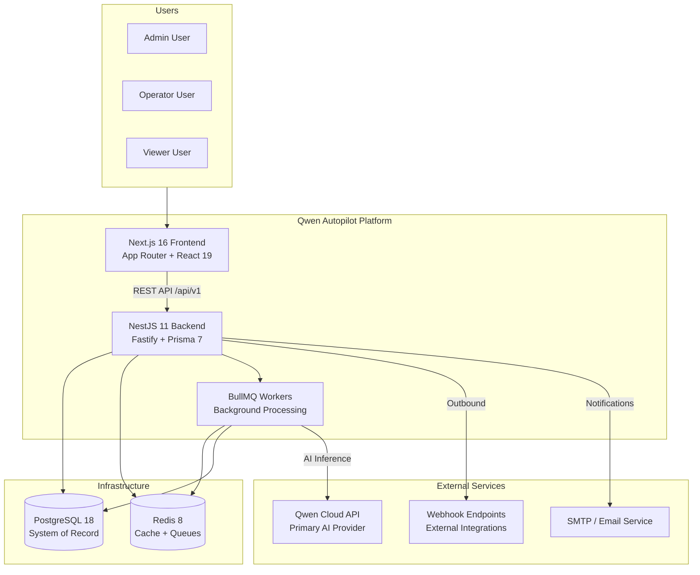
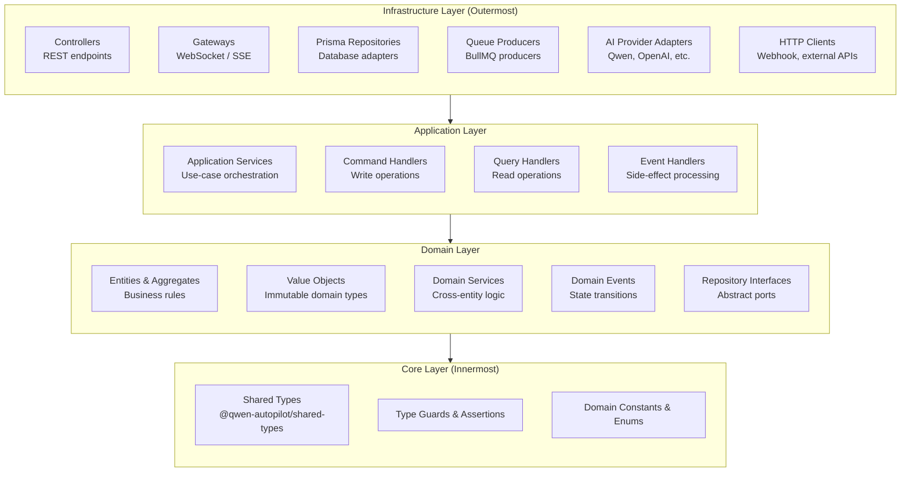
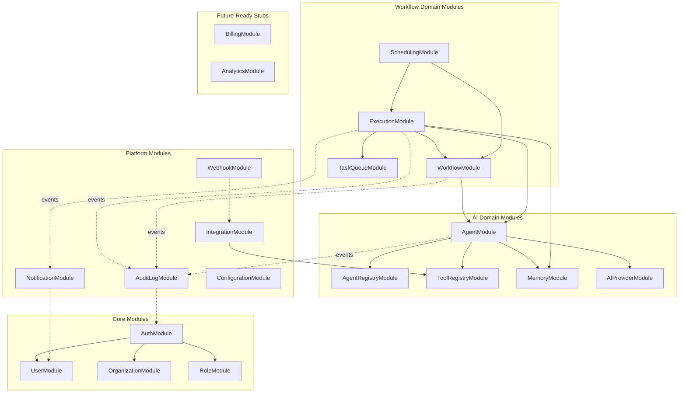
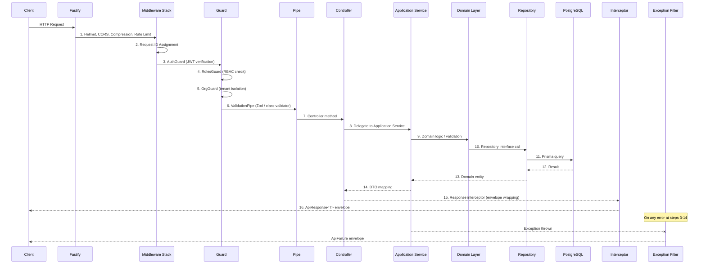
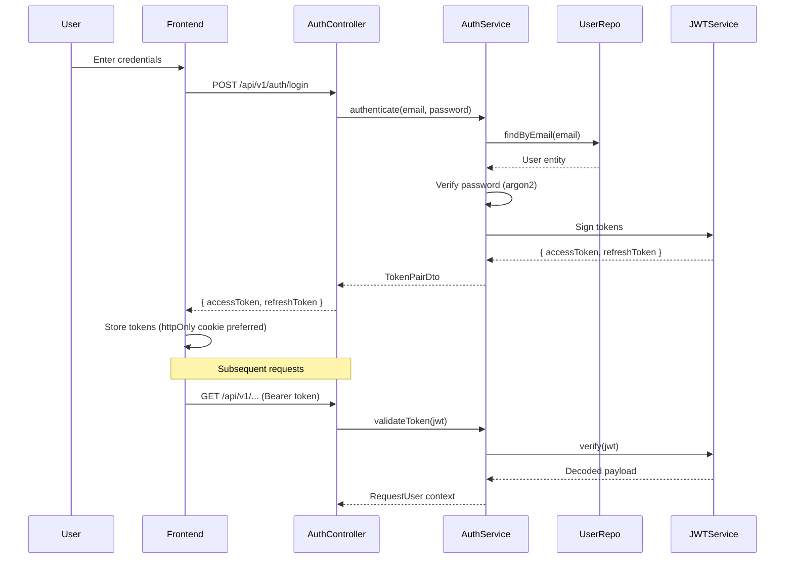
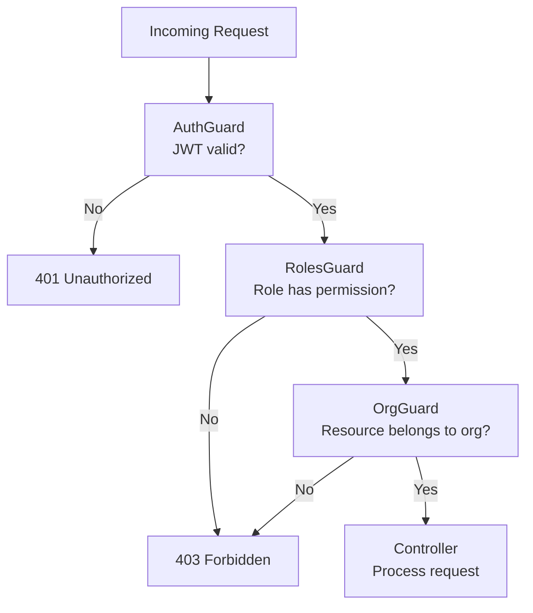
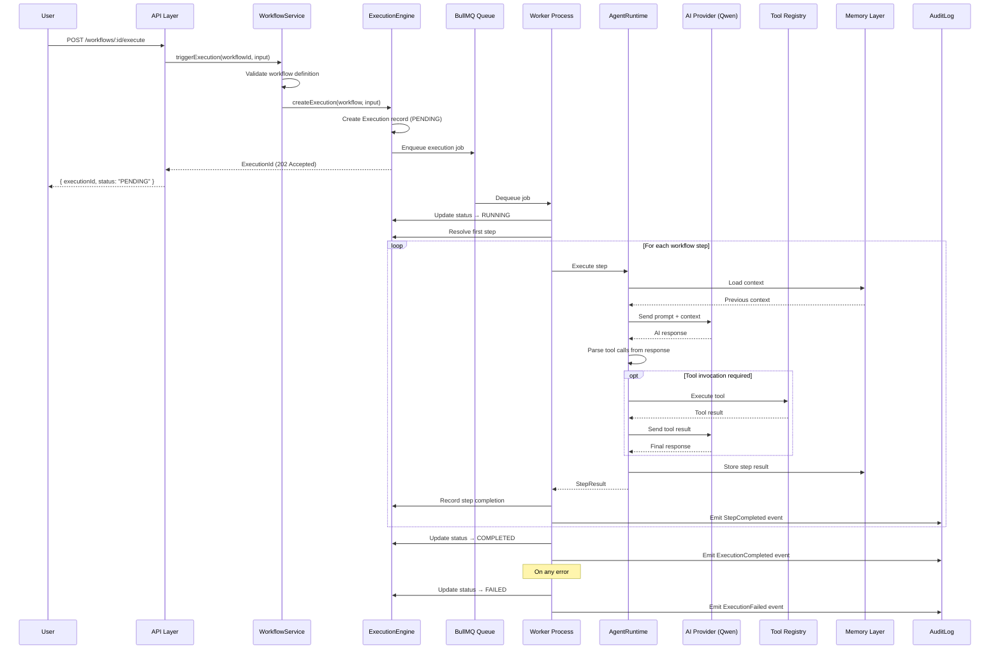

# Qwen Autopilot Platform — Architecture Document

> **Version**: 2.0.0 (Phase 2 Design)
> **Status**: Approved — awaiting implementation
> **Last Updated**: 2026-07-14

---

## Table of Contents

1. [System Overview](#system-overview)
2. [System Context](#system-context)
3. [Clean Architecture Layers](#clean-architecture-layers)
4. [Module Dependency Graph](#module-dependency-graph)
5. [Request Lifecycle](#request-lifecycle)
6. [Authentication & Authorization Flow](#authentication--authorization-flow)
7. [Workflow Execution Pipeline](#workflow-execution-pipeline)
8. [Cross-Cutting Concerns](#cross-cutting-concerns)
9. [Architectural Decision Records](#architectural-decision-records)

---

## System Overview

The Qwen Autopilot Platform is a production-grade autonomous business workflow automation platform built for the Qwen Cloud Global AI Hackathon (Autopilot Agent track). It enables enterprises to define, deploy, and monitor AI-powered agents that execute multi-step business workflows autonomously.

### Core Capabilities

| Capability           | Description                                                            |
| -------------------- | ---------------------------------------------------------------------- |
| **Agent Registry**   | Register, version, and manage AI agents with configurable capabilities |
| **Workflow Engine**  | Define multi-step workflows with branching, loops, and error handling  |
| **Tool Registry**    | Register external tools (APIs, databases, services) agents can invoke  |
| **Execution Engine** | Orchestrate agent executions with retry, timeout, and circuit-breaking |
| **Memory Layer**     | Persistent and ephemeral memory for agent context across executions    |
| **Multi-tenancy**    | Organization-scoped isolation for all domain entities                  |

---

## System Context



---

## Clean Architecture Layers

The backend follows Clean Architecture with four concentric layers. Dependencies point **inward only** — outer layers depend on inner layers, never the reverse.



### Layer Responsibilities

| Layer              | Responsibility                                                 | May Depend On             | Never Depends On            |
| ------------------ | -------------------------------------------------------------- | ------------------------- | --------------------------- |
| **Core**           | Type definitions, enums, constants                             | Nothing                   | Any other layer             |
| **Domain**         | Business rules, entities, value objects, repository interfaces | Core                      | Application, Infrastructure |
| **Application**    | Use-case orchestration, command/query handling                 | Domain, Core              | Infrastructure              |
| **Infrastructure** | Database adapters, HTTP, queues, AI clients                    | Application, Domain, Core | —                           |

### Why Clean Architecture?

1. **Testability**: Domain and application layers are pure TypeScript — no framework dependencies, no database, no HTTP. Unit tests run in milliseconds.
2. **Swappability**: AI providers, databases, and queue systems can be swapped by replacing infrastructure adapters without touching business logic.
3. **Modularity**: Each bounded context is self-contained. Adding a new domain (e.g., Billing) doesn't require modifying existing modules.
4. **Hackathon velocity**: Counterintuitively, the clean separation makes rapid iteration faster because changes are localized. Changing an AI provider is a single adapter file, not a codebase-wide refactor.

---

## Module Dependency Graph

Each bounded context is a NestJS module. Modules communicate through well-defined interfaces — no cross-module direct database access.



### Dependency Rules

1. **No circular imports**: Module A → B and B → A is forbidden. Use events for reverse communication.
2. **Events for cross-cutting**: AuditLog, Notifications, and Analytics subscribe to domain events — they never import domain modules directly.
3. **Shared infrastructure**: `DatabaseModule`, `RedisModule`, `ConfigModule`, and `LoggerModule` are global — available to all modules without explicit imports.
4. **Stub modules**: `BillingModule` and `AnalyticsModule` export empty service interfaces. Implementation is deferred to future phases.

---

## Request Lifecycle

Every HTTP request follows this deterministic pipeline:



### Pipeline Components

| Step  | Component            | Purpose                                             |
| ----- | -------------------- | --------------------------------------------------- |
| 1     | Fastify Plugins      | Security headers, CORS, compression, rate limiting  |
| 2     | RequestIdInterceptor | Assigns `x-request-id` for distributed tracing      |
| 3     | AuthGuard            | Validates JWT, extracts user context                |
| 4     | RolesGuard           | Checks user role against required permissions       |
| 5     | OrgGuard             | Ensures request is scoped to user's organization    |
| 6     | ValidationPipe       | Schema validation via Zod (DTOs) or class-validator |
| 7     | Controller           | Thin HTTP adapter — no business logic               |
| 8     | Application Service  | Use-case orchestration, transaction boundaries      |
| 9     | Domain Layer         | Business rules, invariant enforcement               |
| 10-12 | Repository → DB      | Data persistence via Prisma                         |
| 15    | Response Interceptor | Wraps result in `ApiSuccess<T>` envelope            |
| Error | AllExceptionsFilter  | Catches all errors, returns `ApiFailure` envelope   |

---

## Authentication & Authorization Flow

### Authentication (JWT-based)



### Authorization (RBAC + Resource Scoping)



### Role Hierarchy

| Role           | Scope        | Capabilities                                                   |
| -------------- | ------------ | -------------------------------------------------------------- |
| **SuperAdmin** | Platform     | Manage all organizations, platform configuration               |
| **OrgOwner**   | Organization | Full control over org resources, manage members                |
| **OrgAdmin**   | Organization | Manage agents, workflows, integrations, members (except owner) |
| **Operator**   | Organization | Create/execute workflows, manage agents                        |
| **Viewer**     | Organization | Read-only access to dashboards, execution logs                 |

### Permission Model

Permissions are additive and attached to roles. Example permission strings:

```
agent:create, agent:read, agent:update, agent:delete, agent:execute
workflow:create, workflow:read, workflow:update, workflow:delete, workflow:execute
execution:read, execution:cancel
organization:read, organization:update, organization:manage-members
audit:read
```

---

## Workflow Execution Pipeline

This is the core value of the platform — the pipeline that orchestrates AI agent execution.



### Execution States

```mermaid
statechart-v2
    [*] --> PENDING: Created
    PENDING --> QUEUED: Enqueued to BullMQ
    QUEUED --> RUNNING: Worker picks up
    RUNNING --> PAUSED: Manual pause / approval gate
    PAUSED --> RUNNING: Resume
    RUNNING --> COMPLETED: All steps done
    RUNNING --> FAILED: Unrecoverable error
    RUNNING --> CANCELLED: User cancellation
    FAILED --> RETRYING: Auto-retry triggered
    RETRYING --> RUNNING: Retry attempt
    RETRYING --> FAILED: Max retries exceeded
    COMPLETED --> [*]
    FAILED --> [*]
    CANCELLED --> [*]
```

---

## Cross-Cutting Concerns

### Logging

| Concern     | Implementation                                             |
| ----------- | ---------------------------------------------------------- |
| Library     | Pino via `nestjs-pino`                                     |
| Format      | JSON in production, pretty-print in development            |
| Correlation | `x-request-id` propagated through all log entries          |
| Redaction   | `authorization`, `cookie`, `password` fields auto-redacted |
| Levels      | `fatal > error > warn > info > debug > trace`              |

### Observability (OpenTelemetry-Ready)

- Request IDs already assigned at HTTP edge (Phase 1)
- Structured log format supports future OTLP export
- Health check endpoint exists at `/api/v1/health`
- Metric collection deferred until deployment target is known

### Security

| Control          | Implementation                                       |
| ---------------- | ---------------------------------------------------- |
| Helmet           | Security headers on all responses                    |
| CORS             | Configurable origin whitelist                        |
| Rate Limiting    | Configurable per-endpoint (default: 300/min)         |
| Input Validation | Zod schemas at DTO boundaries                        |
| Password Hashing | Argon2id (future implementation)                     |
| JWT              | Short-lived access tokens + refresh token rotation   |
| SQL Injection    | Prisma parameterized queries (no raw SQL)            |
| XSS              | No `dangerouslySetInnerHTML`, CSP headers via Helmet |

### Error Handling Strategy

All errors flow through `AllExceptionsFilter` and are returned in the `ApiFailure` envelope:

```json
{
  "success": false,
  "error": {
    "statusCode": 422,
    "code": "UNPROCESSABLE_ENTITY",
    "message": "Workflow definition contains a cycle at step 3",
    "requestId": "req_01J5K...",
    "timestamp": "2026-07-14T17:00:00.000Z"
  }
}
```

### Audit Trail

Every state-changing operation emits a domain event captured by the `AuditLogModule`:

```typescript
interface AuditLogEntry {
  id: string; // UUID v7
  timestamp: Date;
  organizationId: string;
  actorId: string; // User who performed the action
  actorType: "user" | "system" | "agent";
  action: string; // e.g., 'workflow.created'
  resourceType: string; // e.g., 'Workflow'
  resourceId: string;
  changes: Record<string, { before: unknown; after: unknown }>;
  metadata: Record<string, unknown>;
}
```

---

## Architectural Decision Records

### ADR-001: Modular Monolith Over Microservices

**Context**: The platform needs clear module boundaries but the team is small and the hackathon timeline is tight.

**Decision**: Start as a modular monolith with NestJS modules as bounded contexts. Each module has clean interfaces that can be extracted to a microservice later.

**Rationale**:

- Single deployment unit reduces operational complexity
- In-process communication eliminates network latency between modules
- NestJS module system enforces boundaries without the overhead of service mesh
- Migration path to microservices is natural: extract a module to its own NestJS app

**Consequences**: All modules share one PostgreSQL database. Cross-module queries are possible but discouraged — modules should communicate through services.

---

### ADR-002: UUID v7 for All Primary Keys

**Context**: Need globally unique, sortable identifiers that don't leak information.

**Decision**: Use UUID v7 (RFC 9562) for all primary keys.

**Rationale**:

- Time-sortable: natural ordering without a separate `createdAt` index
- No central coordinator needed (unlike auto-increment)
- 128-bit: collision probability is negligible
- PostgreSQL `uuid` type has native support and B-tree indexing
- Does not leak creation rate (unlike ULID string encoding)

**Consequences**: Slightly larger than integer IDs (16 bytes vs 4 bytes). Acceptable tradeoff for the benefits.

---

### ADR-003: Strategy Pattern for AI Providers

**Context**: Qwen is the primary AI provider for the hackathon, but the platform should support other providers for enterprise adoption.

**Decision**: Abstract AI providers behind a `AIProviderStrategy` interface. A factory selects the correct adapter based on agent configuration.

**Rationale**:

- Open/Closed principle: add new providers without modifying existing code
- Each agent can specify its preferred provider
- Fallback chains: if Qwen is unavailable, fall back to a secondary provider
- Testing: mock provider for integration tests

**Consequences**: Slight abstraction overhead. Every provider must implement the same interface, which may not perfectly fit all provider APIs. Adapter pattern handles the mapping.

---

### ADR-004: BullMQ for Task Queue Over Custom Implementation

**Context**: Workflow executions are long-running and must survive process restarts.

**Decision**: Use BullMQ backed by Redis for all async job processing.

**Rationale**:

- Already configured in Phase 1
- Durable: jobs survive worker crashes (Redis persistence)
- Built-in retry with exponential backoff
- Priority queues for urgent executions
- Rate limiting per queue
- Bull Board for monitoring (future)
- Battle-tested in production NestJS deployments

**Consequences**: Redis is a single point of failure for the queue. Mitigated by Redis persistence (AOF) and the fact that PostgreSQL is the system of record — failed jobs can be re-enqueued from execution records.

---

### ADR-005: Event-Driven Cross-Cutting Concerns

**Context**: AuditLog, Notifications, and Analytics need to react to domain events without coupling to domain modules.

**Decision**: Use NestJS `EventEmitter2` for in-process domain events. Listeners are registered in their respective modules.

**Rationale**:

- No external infrastructure needed (no Kafka, no RabbitMQ)
- Synchronous event handling keeps the request lifecycle simple
- Easy to migrate to async events (BullMQ) when throughput demands it
- Type-safe event payloads via TypeScript interfaces

**Consequences**: Events are in-process only — if the process crashes mid-event, the event is lost. Acceptable because:

1. Audit logs can be reconstructed from execution records
2. Notifications are best-effort
3. Critical state changes are persisted in PostgreSQL before events fire

---

### ADR-006: Soft Deletes with `deletedAt` Timestamp

**Context**: Domain entities (agents, workflows, organizations) should not be permanently deleted to support audit trails and recovery.

**Decision**: All domain entities use soft deletes via a nullable `deletedAt` timestamp. Prisma middleware automatically filters soft-deleted records.

**Rationale**:

- Audit compliance: deleted records remain queryable
- Recovery: accidental deletions can be reversed
- Referential integrity: foreign keys remain valid
- No data loss during development

**Consequences**: All queries must filter `WHERE deletedAt IS NULL`. Prisma middleware handles this globally. Periodic hard-delete jobs will purge records older than a retention period (configurable per org).

---

### ADR-007: Optimistic Locking for Concurrent Updates

**Context**: Multiple users or agents may update the same workflow or agent configuration concurrently.

**Decision**: Use a `version` integer column. On update, increment `version` and include `WHERE version = expected_version` in the query. If no rows are updated, throw a `ConflictException`.

**Rationale**:

- No database-level locks: better throughput than pessimistic locking
- Simple implementation: single integer column
- Clear conflict resolution: client receives 409 Conflict and can retry with fresh data
- Standard pattern supported by Prisma

**Consequences**: Requires client cooperation — the frontend must include the current version in update requests. The API contract includes `version` in all mutable entity responses.

---

### ADR-008: Contract-First Frontend-Backend Development

**Context**: Per the user's Engineering Manager rules, API contracts must be established before any frontend or backend code is written.

**Decision**: All API contracts are defined as TypeScript interfaces in `@qwen-autopilot/shared-types`. Backend controllers and frontend API clients are generated/validated against these contracts.

**Rationale**:

- Single source of truth for request/response shapes
- Frontend and backend can develop in parallel
- Breaking changes are caught at compile time
- Aligns with user's "Contract-Driven Development" directive

**Consequences**: Changes to API shape require updating the shared-types package first, then propagating to both apps. This adds a step but prevents runtime contract violations.
