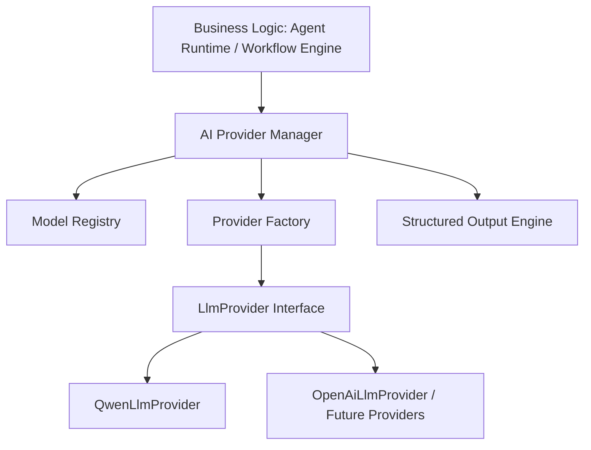
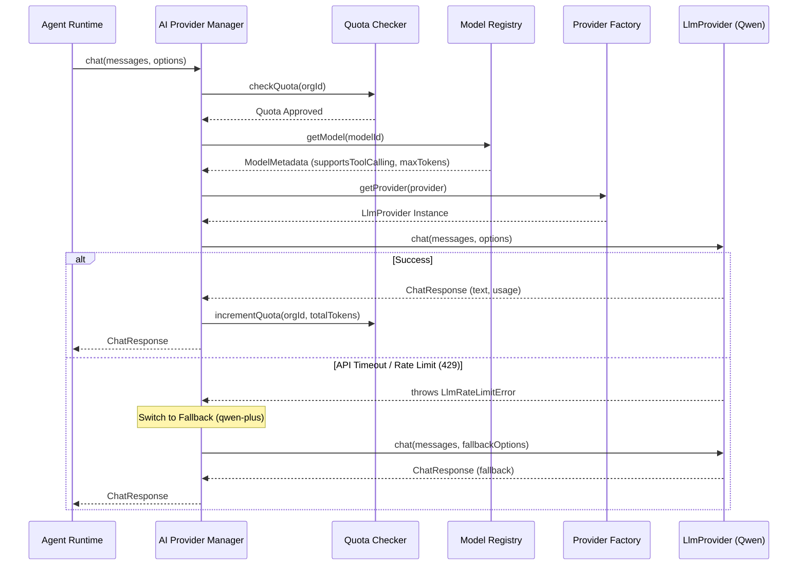
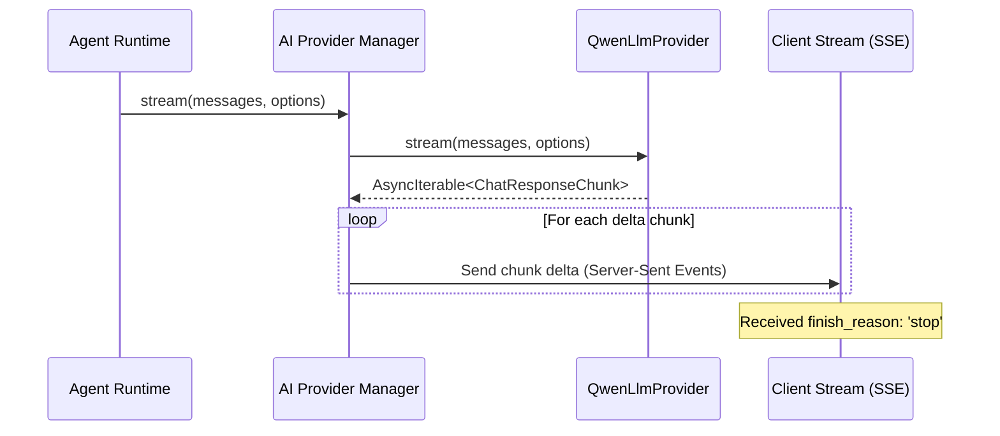
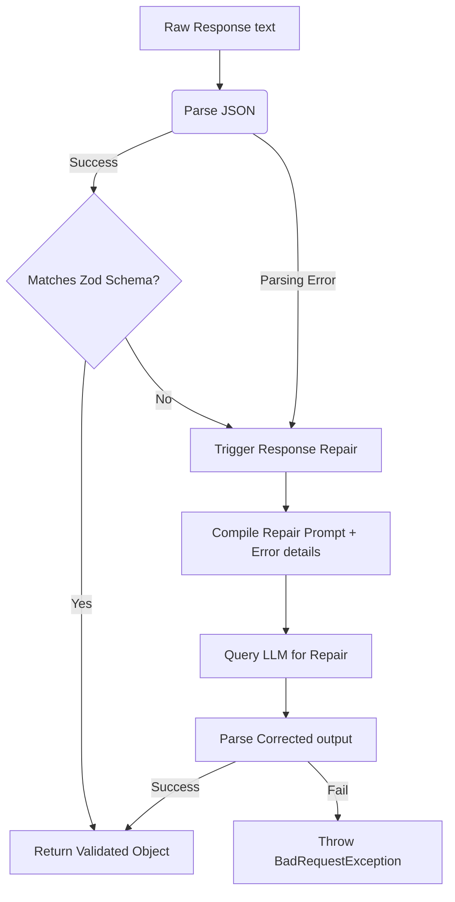

# AI Provider Layer Architecture Documentation & Operational Runbook

This documentation details the architecture, design choices, extending policies, and operational runbooks for the AI Provider Layer.

---

## 1. Provider Architecture Overview

The AI Provider Layer acts as a decoupled abstraction boundary between core application logic (such as agents, workflows, and tools) and downstream LLM APIs (like Qwen Cloud, OpenAI, or Anthropic).



### Key Components

1. **AI Provider Manager**: The central orchestrator. Checks tenant quotas, handles fallback strategies, and dispatches prompts.
2. **Model Registry**: Configures active model properties, context capacities, pricing per million tokens, and capability flags (like `supportsStreaming`, `supportsVision`).
3. **Provider Factory**: Instantiates the target `LlmProvider` dynamically.
4. **Structured Output Engine**: Formats schema validations and runs JSON repair loops if raw text outputs are malformed.

---

## 2. Dynamic Lifecycle Flows

### Execution Sequence (Chat Completion & Fallback)



### Streaming LifeCycle Flow



### Structured Output Flow (JSON Validation & Repair)



---

## 3. Configuration Guide

System options are defined and validated in the environment schema `apps/backend/src/config/env.schema.ts`.

### Active Environment Variables

| Variable                  | Description                               | Default                                             |
| ------------------------- | ----------------------------------------- | --------------------------------------------------- |
| `QWEN_API_URL`            | Endpoint of the Qwen Cloud API            | `https://dashscope.aliyuncs.com/compatible-mode/v1` |
| `QWEN_API_KEY`            | Authentication bearer key                 | `mock-key` (Triggering test mock mode)              |
| `JWT_ACCESS_TOKEN_SECRET` | Secret token to sign user session context | Required                                            |

---

## 4. Extension Guide: Adding a New Provider

To register a new provider (e.g. `Gemini` or `Anthropic`), follow these steps:

1. **Implement the LlmProvider Interface**:
   Create `gemini-provider.service.ts` matching the [LlmProvider](file:///home/talented/Desktop/Personal/qwen_hack/apps/backend/src/modules/ai-provider/llm-provider.interface.ts) contract.
2. **Export standard errors**:
   Map HTTP failures inside `gemini-provider.service.ts` catch blocks utilizing `LlmError` subclasses (`LlmRateLimitError`, `LlmAuthenticationError`).
3. **Update Provider Factory**:
   Add dynamic mapping inside `ProviderFactoryService.getProvider()`:
   ```typescript
   if (formatted === "GEMINI") {
     return this.geminiProvider;
   }
   ```
4. **Register in Model Registry**:
   Add active metadata fields to the database `model_definitions` table matching the new model configuration properties.

---

## 5. Operational Runbook

### Handling Rate Limit Exceeded Alerts (HTTP 429)

1. **Diagnosis**: Inspect logs for `LLM_RATE_LIMIT_EXCEEDED` warnings.
2. **Mitigation**:
   - Check if organization concurrent execution limits can be throttled.
   - Adjust default fallback settings to alternate providers in the workspace settings.
   - Scale API subscription plans or set up localized API keys.

### Resolving Authentication Outages (HTTP 401)

1. **Diagnosis**: Check log metrics. If `LLM_AUTHENTICATION_FAILURE` is raised, Qwen API keys are incorrect or expired.
2. **Mitigation**:
   - Update `QWEN_API_KEY` in environment configurations.
   - Reload NestJS server tasks.
