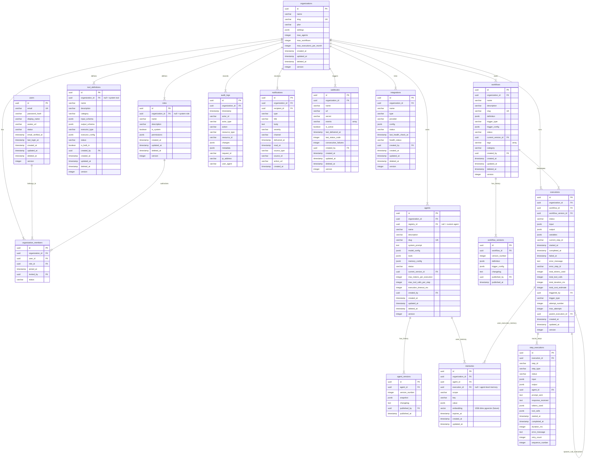

# Qwen Autopilot Platform — Database Design

> **Version**: 2.0.0 (Phase 2 Design)
> **Status**: Approved — awaiting implementation

---

## Entity-Relationship (ER) Diagram

---

## Database Design Specifications

### UUID Strategy: UUIDv7

To ensure high-performance indexing and scale, **UUIDv7 (time-based, lexicographically sortable)** is specified for all primary keys.

- **Benefits**: Unlike random UUIDv4, UUIDv7 incorporates a Unix epoch timestamp at the start of the 128-bit value. This results in sequential insert keys, avoiding page splitting in B-Tree indices while keeping primary keys globally unique across nodes.
- **Implementation**: Generated either at the application level via `@types/uuid` or inside PostgreSQL using a custom function/extension before schema initialization.

### Indexing Strategy

To optimize latency for multi-tenant and query operations, the following indexes are specified:

1. **Multi-tenancy isolation**:
   - Every tenant table has a compound index or foreign key index on `organization_id` combined with specific query properties.
   - Example: `IDX_agent_organization` on `agents(organization_id, slug)` where slug is queried within the tenant scope.

2. **Query Optimization**:
   - `users(email)`: Unique index.
   - `organizations(slug)`: Unique index.
   - `workflow_versions(workflow_id, version_number)`: Compound index for quick version lookups.
   - `agent_versions(agent_id, version_number)`: Compound index.
   - `executions(organization_id, status)`: Fast filtering of active runs.
   - `step_executions(execution_id, sequence_number)`: Retrieve step histories in insertion order.
   - `memories(agent_id, key)`: Index on key lookup.
   - `audit_logs(organization_id, timestamp)`: Optimized for pagination.

### Soft Deletes

All core entities (`users`, `organizations`, `roles`, `agents`, `tool_definitions`, `workflows`, `webhooks`, `integrations`) use **Soft Deletes**.

- **Field**: `deleted_at TIMESTAMP NULL`
- **Behavior**: When deleted, `deleted_at` is set to the current time. All queries at the repository level include `WHERE deleted_at IS NULL` by default.
- **Exception**: Run history entities (`executions`, `step_executions`, `audit_logs`) do not support soft deletes to protect audit compliance.

### Audit Fields

All mutable tables contain standard audit fields:

- `created_at TIMESTAMP DEFAULT CURRENT_TIMESTAMP`: Read-only creation timestamp.
- `updated_at TIMESTAMP DEFAULT CURRENT_TIMESTAMP`: Updated automatically on modifications.
- `version INTEGER DEFAULT 1`: Used for optimistic locking.

### Optimistic Locking

To prevent concurrent overwrite anomalies when multiple users or autonomous agents edit configurations:

- Every update request contains the `version` the client read.
- The SQL query checks `WHERE id = ? AND version = ?`.
- On success, the version is incremented (`version = version + 1`).
- If zero rows are affected, a `ConflictException` is returned to prompt a merge/retry.
