# Qwen Autopilot Platform — Domain Model

> **Version**: 2.0.0 (Phase 2 Design)
> **Status**: Approved — awaiting implementation

---

## Table of Contents

1. [Bounded Context Map](#bounded-context-map)
2. [Identity & Access Context](#identity--access-context)
3. [Agent Context](#agent-context)
4. [Workflow Context](#workflow-context)
5. [Execution Context](#execution-context)
6. [Platform Context](#platform-context)
7. [DTO Boundaries](#dto-boundaries)
8. [Repository Interfaces](#repository-interfaces)
9. [Domain Services](#domain-services)
10. [Application Services](#application-services)

---

## Bounded Context Map

```mermaid
flowchart LR
    subgraph IAM["Identity & Access Context"]
        User
        Organization
        Role
        Permission
        Session
    end

    subgraph AgentCtx["Agent Context"]
        Agent
        AgentVersion
        AgentRegistry
        ToolDefinition
        ToolRegistry
        Memory
    end

    subgraph WorkflowCtx["Workflow Context"]
        Workflow
        WorkflowVersion
        WorkflowStep
        StepConnection
        Schedule
    end

    subgraph ExecCtx["Execution Context"]
        Execution
        StepExecution
        TaskJob
    end

    subgraph PlatformCtx["Platform Context"]
        AuditLog
        Notification
        Webhook
        Integration
        AppConfig
    end

    IAM -->|"owns"| AgentCtx
    IAM -->|"owns"| WorkflowCtx
    AgentCtx -->|"used by"| ExecCtx
    WorkflowCtx -->|"orchestrated by"| ExecCtx
    ExecCtx -.->|"events"| PlatformCtx
    IAM -.->|"events"| PlatformCtx
```



### Context Relationships

| Upstream          | Downstream      | Relationship       | Mechanism                                        |
| ----------------- | --------------- | ------------------ | ------------------------------------------------ |
| Identity & Access | Agent, Workflow | Customer-Supplier  | Direct service call (same process)               |
| Agent             | Execution       | Conformist         | Execution conforms to Agent's interface          |
| Workflow          | Execution       | Conformist         | Execution conforms to Workflow's step definition |
| Execution         | Platform        | Published Language | Domain events with typed payloads                |
| Identity & Access | Platform        | Published Language | Domain events                                    |

---

## Identity & Access Context

### Aggregate: User

The `User` is the root aggregate for identity. It owns sessions and organization memberships.

```typescript
// ═══════════════════════════════════════════
// AGGREGATE ROOT
// ═══════════════════════════════════════════

interface User {
  // Identity
  id: UserId; // UUID v7
  email: Email; // Value Object — validated, normalized
  passwordHash: PasswordHash; // Value Object — argon2id hash

  // Profile
  displayName: string;
  avatarUrl: string | null;

  // State
  status: UserStatus; // ACTIVE | SUSPENDED | PENDING_VERIFICATION
  emailVerifiedAt: Date | null;
  lastLoginAt: Date | null;

  // Audit
  createdAt: Date;
  updatedAt: Date;
  deletedAt: Date | null; // Soft delete
  version: number; // Optimistic locking
}

// Why Aggregate Root: User is the transactional boundary for identity
// operations. Creating, suspending, or deleting a user is a single
// atomic operation. Organization memberships reference users but are
// managed through the Organization aggregate.
```

### Aggregate: Organization

```typescript
interface Organization {
  id: OrganizationId; // UUID v7
  name: string;
  slug: Slug; // Value Object — URL-safe, unique
  plan: OrganizationPlan; // FREE | PRO | ENTERPRISE (future billing)
  settings: OrganizationSettings; // Value Object — JSON config

  // Limits
  maxAgents: number;
  maxWorkflows: number;
  maxExecutionsPerMonth: number;

  // Audit
  createdAt: Date;
  updatedAt: Date;
  deletedAt: Date | null;
  version: number;
}

// Why Aggregate Root: Organization is the tenancy boundary. All domain
// entities are scoped to an organization. Organization manages its own
// member list and resource limits as a single transactional unit.
```

### Entity: OrganizationMember (within Organization aggregate)

```typescript
interface OrganizationMember {
  id: OrganizationMemberId;
  organizationId: OrganizationId;
  userId: UserId;
  roleId: RoleId;
  joinedAt: Date;
  invitedBy: UserId | null;
  status: MemberStatus; // ACTIVE | INVITED | SUSPENDED
}

// Why Entity (not Aggregate): OrganizationMember only exists within the
// context of an Organization. It cannot exist independently. Changes to
// membership are part of the Organization's transactional boundary.
```

### Aggregate: Role

```typescript
interface Role {
  id: RoleId; // UUID v7
  organizationId: OrganizationId | null; // null = system role
  name: string;
  description: string;
  isSystem: boolean; // true = cannot be modified/deleted
  permissions: Permission[]; // Value Objects

  createdAt: Date;
  updatedAt: Date;
  deletedAt: Date | null;
  version: number;
}

// Why Aggregate Root: Roles are referenced by multiple OrganizationMembers
// but managed independently. Creating custom roles, modifying permissions,
// and deleting roles are self-contained operations.
```

### Value Objects

```typescript
// ═══════════════════════════════════════════
// VALUE OBJECTS — Immutable, identity-less
// ═══════════════════════════════════════════

/** Validated email address. Normalized to lowercase, trimmed. */
interface Email {
  readonly value: string;
  // Invariant: Must match RFC 5322 format
  // Invariant: Normalized to lowercase
}

/** Argon2id password hash. Never exposed outside the domain. */
interface PasswordHash {
  readonly hash: string;
  // Invariant: Must be a valid argon2id hash string
}

/** URL-safe slug for organizations. */
interface Slug {
  readonly value: string;
  // Invariant: lowercase, alphanumeric + hyphens, 3-63 chars
  // Invariant: Unique per entity type
}

/** Permission string following resource:action format. */
interface Permission {
  readonly resource: string; // e.g., 'agent', 'workflow', 'execution'
  readonly action: string; // e.g., 'create', 'read', 'update', 'delete', 'execute'
}

/** Tenant-scoped configuration. */
interface OrganizationSettings {
  readonly defaultAIProvider: string;
  readonly executionTimeoutMs: number;
  readonly maxConcurrentExecutions: number;
  readonly webhookSecret: string | null;
}

// Why Value Objects: These types have no identity — two Email objects with
// the same value are equal. They are immutable and validate invariants
// at construction time, making invalid states unrepresentable.
```

### Enum: UserStatus

```typescript
enum UserStatus {
  ACTIVE = "ACTIVE",
  SUSPENDED = "SUSPENDED",
  PENDING_VERIFICATION = "PENDING_VERIFICATION",
}

enum MemberStatus {
  ACTIVE = "ACTIVE",
  INVITED = "INVITED",
  SUSPENDED = "SUSPENDED",
}
```

---

## Agent Context

### Aggregate: Agent

```typescript
interface Agent {
  id: AgentId; // UUID v7
  organizationId: OrganizationId; // Tenant scope
  registryId: AgentRegistryId | null; // Link to registry template (if cloned)

  // Identity
  name: string;
  description: string;
  slug: Slug;

  // Configuration
  systemPrompt: string; // Base instructions for the agent
  model: AIModelConfig; // Value Object — provider + model + params
  tools: AgentToolBinding[]; // Tools this agent can invoke
  memoryConfig: MemoryConfig; // Value Object — memory strategy

  // State
  status: AgentStatus; // DRAFT | ACTIVE | DISABLED | ARCHIVED
  currentVersionId: AgentVersionId | null;

  // Limits
  maxTokensPerExecution: number;
  maxToolCallsPerStep: number;
  executionTimeoutMs: number;

  // Audit
  createdBy: UserId;
  createdAt: Date;
  updatedAt: Date;
  deletedAt: Date | null;
  version: number;
}

// Why Aggregate Root: Agent is the central business entity. It encapsulates
// its configuration, tool bindings, and memory strategy. Changes to an
// agent's configuration are atomic — you never partially update an agent.
```

### Entity: AgentVersion (within Agent aggregate)

```typescript
interface AgentVersion {
  id: AgentVersionId;
  agentId: AgentId;
  versionNumber: number; // Monotonically increasing
  snapshot: AgentSnapshot; // Value Object — frozen config
  changelog: string;
  publishedBy: UserId;
  publishedAt: Date;
}

// Why Entity: Versions are part of the Agent lifecycle. They reference
// back to the agent and cannot exist independently. Versioning is
// managed within the Agent's transactional boundary.
```

### Aggregate: ToolDefinition

```typescript
interface ToolDefinition {
  id: ToolDefinitionId;
  organizationId: OrganizationId;

  // Identity
  name: string; // Unique within org
  description: string; // Shown to AI for tool selection
  category: ToolCategory; // API | DATABASE | FILE | CUSTOM

  // Schema
  inputSchema: JSONSchema; // Value Object — JSON Schema for parameters
  outputSchema: JSONSchema; // Value Object — JSON Schema for return value

  // Execution
  executorType: ToolExecutorType; // HTTP | GRPC | INTERNAL | WEBHOOK
  executorConfig: ToolExecutorConfig; // Value Object — endpoint, auth, etc.

  // State
  status: ToolStatus; // ACTIVE | DISABLED | DEPRECATED
  isBuiltIn: boolean; // System-provided tools

  // Audit
  createdBy: UserId;
  createdAt: Date;
  updatedAt: Date;
  deletedAt: Date | null;
  version: number;
}

// Why Aggregate Root: Tools are shared across agents. Multiple agents can
// bind the same tool. Tool definitions are managed independently of agents
// and have their own lifecycle (deprecation, versioning).
```

### Aggregate: Memory

```typescript
interface Memory {
  id: MemoryId;
  organizationId: OrganizationId;
  agentId: AgentId;
  executionId: ExecutionId | null; // null = agent-level memory

  // Content
  scope: MemoryScope; // EXECUTION | AGENT | ORGANIZATION
  key: string; // Namespaced key
  value: unknown; // Structured data (JSONB in DB)
  embedding: number[] | null; // Optional vector for semantic search

  // Lifecycle
  expiresAt: Date | null; // TTL for ephemeral memory
  createdAt: Date;
  updatedAt: Date;
}

// Why Aggregate Root: Memory entries are independently managed. They span
// different scopes (execution, agent, org) and have their own lifecycle
// (TTL-based expiration). Agents read and write memory during execution
// but memory persists beyond individual executions.
```

### Value Objects (Agent Context)

```typescript
interface AIModelConfig {
  readonly provider: AIProviderType; // QWEN | OPENAI | ANTHROPIC | LOCAL
  readonly model: string; // e.g., 'qwen-max', 'qwen-plus'
  readonly temperature: number; // 0.0 - 2.0
  readonly maxTokens: number;
  readonly topP: number;
  readonly frequencyPenalty: number;
  readonly presencePenalty: number;
}

interface MemoryConfig {
  readonly strategy: MemoryStrategy; // FULL | SLIDING_WINDOW | SUMMARY | NONE
  readonly maxEntries: number;
  readonly windowSize: number; // For SLIDING_WINDOW
  readonly ttlMs: number | null; // Auto-expire
}

interface AgentToolBinding {
  readonly toolDefinitionId: ToolDefinitionId;
  readonly alias: string | null; // Override name shown to AI
  readonly isRequired: boolean; // Must be available for execution
}

interface AgentSnapshot {
  readonly systemPrompt: string;
  readonly model: AIModelConfig;
  readonly tools: AgentToolBinding[];
  readonly memoryConfig: MemoryConfig;
}

interface JSONSchema {
  readonly schema: Record<string, unknown>; // JSON Schema Draft 2020-12
}

interface ToolExecutorConfig {
  readonly endpoint: string;
  readonly method: string;
  readonly headers: Record<string, string>;
  readonly authType: ToolAuthType; // NONE | API_KEY | BEARER | OAUTH2
  readonly authConfig: Record<string, string>;
  readonly timeoutMs: number;
  readonly retryCount: number;
}

enum AIProviderType {
  QWEN = "QWEN",
  OPENAI = "OPENAI",
  ANTHROPIC = "ANTHROPIC",
  LOCAL = "LOCAL",
}

enum ToolCategory {
  API = "API",
  DATABASE = "DATABASE",
  FILE = "FILE",
  CUSTOM = "CUSTOM",
}

enum ToolExecutorType {
  HTTP = "HTTP",
  GRPC = "GRPC",
  INTERNAL = "INTERNAL",
  WEBHOOK = "WEBHOOK",
}

enum ToolAuthType {
  NONE = "NONE",
  API_KEY = "API_KEY",
  BEARER = "BEARER",
  OAUTH2 = "OAUTH2",
}

enum AgentStatus {
  DRAFT = "DRAFT",
  ACTIVE = "ACTIVE",
  DISABLED = "DISABLED",
  ARCHIVED = "ARCHIVED",
}

enum MemoryScope {
  EXECUTION = "EXECUTION",
  AGENT = "AGENT",
  ORGANIZATION = "ORGANIZATION",
}

enum MemoryStrategy {
  FULL = "FULL",
  SLIDING_WINDOW = "SLIDING_WINDOW",
  SUMMARY = "SUMMARY",
  NONE = "NONE",
}
```

---

## Workflow Context

### Aggregate: Workflow

```typescript
interface Workflow {
  id: WorkflowId;
  organizationId: OrganizationId;

  // Identity
  name: string;
  description: string;
  slug: Slug;

  // Definition
  definition: WorkflowDefinition; // Value Object — the workflow graph
  triggerType: WorkflowTriggerType; // MANUAL | SCHEDULED | WEBHOOK | EVENT
  triggerConfig: TriggerConfig; // Value Object

  // State
  status: WorkflowStatus; // DRAFT | ACTIVE | PAUSED | ARCHIVED
  currentVersionId: WorkflowVersionId | null;

  // Metadata
  tags: string[];
  category: string | null;

  // Audit
  createdBy: UserId;
  createdAt: Date;
  updatedAt: Date;
  deletedAt: Date | null;
  version: number;
}

// Why Aggregate Root: Workflow is the unit of business process definition.
// It owns its step graph, versioning, and trigger configuration. Creating,
// modifying, and publishing a workflow is a single atomic transaction.
```

### Entity: WorkflowVersion (within Workflow aggregate)

```typescript
interface WorkflowVersion {
  id: WorkflowVersionId;
  workflowId: WorkflowId;
  versionNumber: number;
  definition: WorkflowDefinition; // Frozen snapshot
  triggerConfig: TriggerConfig;
  changelog: string;
  publishedBy: UserId;
  publishedAt: Date;
}
```

### Value Objects (Workflow Context)

```typescript
/** The directed acyclic graph of workflow steps. */
interface WorkflowDefinition {
  readonly steps: WorkflowStep[];
  readonly connections: StepConnection[];
  readonly variables: WorkflowVariable[]; // Input/output schema
  // Invariant: Must be a valid DAG (no cycles)
  // Invariant: Exactly one START step
  // Invariant: At least one END step
  // Invariant: All connections reference existing steps
}

interface WorkflowStep {
  readonly stepId: string; // Unique within workflow
  readonly name: string;
  readonly type: StepType;
  readonly config: StepConfig;
  readonly position: { x: number; y: number }; // For visual editor
}

enum StepType {
  START = "START",
  END = "END",
  AGENT_TASK = "AGENT_TASK", // Invoke an AI agent
  TOOL_CALL = "TOOL_CALL", // Direct tool invocation
  CONDITION = "CONDITION", // If/else branching
  LOOP = "LOOP", // For-each / while
  PARALLEL = "PARALLEL", // Fan-out / fan-in
  WAIT = "WAIT", // Timer or approval gate
  TRANSFORM = "TRANSFORM", // Data mapping
  WEBHOOK_TRIGGER = "WEBHOOK_TRIGGER", // Wait for external event
  SUB_WORKFLOW = "SUB_WORKFLOW", // Invoke another workflow
}

type StepConfig =
  | AgentTaskConfig
  | ToolCallConfig
  | ConditionConfig
  | LoopConfig
  | ParallelConfig
  | WaitConfig
  | TransformConfig
  | WebhookTriggerConfig
  | SubWorkflowConfig;

interface AgentTaskConfig {
  readonly agentId: AgentId;
  readonly promptTemplate: string; // Supports {{variable}} interpolation
  readonly inputMapping: Record<string, string>;
  readonly outputMapping: Record<string, string>;
  readonly maxRetries: number;
  readonly timeoutMs: number;
}

interface ConditionConfig {
  readonly expression: string; // JSONPath or simple expression
  readonly trueBranch: string; // stepId to follow if true
  readonly falseBranch: string; // stepId to follow if false
}

interface LoopConfig {
  readonly iteratorExpression: string; // JSONPath to array
  readonly itemVariable: string; // Variable name for current item
  readonly bodyStepId: string; // First step in loop body
  readonly maxIterations: number; // Safety limit
}

interface ParallelConfig {
  readonly branches: string[]; // stepIds to execute in parallel
  readonly joinStrategy: "ALL" | "ANY"; // Wait for all or first
}

interface WaitConfig {
  readonly type: "TIMER" | "APPROVAL";
  readonly durationMs: number | null; // For TIMER
  readonly approverRoleId: RoleId | null; // For APPROVAL
}

interface StepConnection {
  readonly fromStepId: string;
  readonly toStepId: string;
  readonly label: string | null; // e.g., "true", "false", "default"
  readonly condition: string | null; // Optional guard expression
}

interface WorkflowVariable {
  readonly name: string;
  readonly type: "string" | "number" | "boolean" | "object" | "array";
  readonly direction: "INPUT" | "OUTPUT" | "INTERNAL";
  readonly defaultValue: unknown | null;
  readonly required: boolean;
  readonly description: string;
}

interface TriggerConfig {
  readonly type: WorkflowTriggerType;
  readonly schedule: CronExpression | null; // For SCHEDULED
  readonly webhookPath: string | null; // For WEBHOOK
  readonly eventType: string | null; // For EVENT
  readonly inputSchema: JSONSchema | null; // For MANUAL / WEBHOOK
}

enum WorkflowTriggerType {
  MANUAL = "MANUAL",
  SCHEDULED = "SCHEDULED",
  WEBHOOK = "WEBHOOK",
  EVENT = "EVENT",
}

enum WorkflowStatus {
  DRAFT = "DRAFT",
  ACTIVE = "ACTIVE",
  PAUSED = "PAUSED",
  ARCHIVED = "ARCHIVED",
}

type CronExpression = string; // Validated 5-field cron expression
```

---

## Execution Context

### Aggregate: Execution

```typescript
interface Execution {
  id: ExecutionId; // UUID v7
  organizationId: OrganizationId;
  workflowId: WorkflowId;
  workflowVersionId: WorkflowVersionId;

  // Runtime
  status: ExecutionStatus;
  input: Record<string, unknown>; // Workflow input variables
  output: Record<string, unknown> | null;
  variables: Record<string, unknown>; // Runtime variable state
  currentStepId: string | null;

  // Tracking
  startedAt: Date | null;
  completedAt: Date | null;
  failedAt: Date | null;
  errorMessage: string | null;
  errorStepId: string | null;

  // Metrics
  totalTokensUsed: number;
  totalToolCalls: number;
  totalDurationMs: number | null;
  totalCostEstimate: number | null; // In credits/cents

  // Trigger
  triggeredBy: UserId | null; // null = system/schedule
  triggerType: WorkflowTriggerType;

  // Retry
  attemptNumber: number;
  maxAttempts: number;
  parentExecutionId: ExecutionId | null; // For sub-workflow calls

  // Audit
  createdAt: Date;
  updatedAt: Date;
  version: number;
}

// Why Aggregate Root: Execution is the core runtime entity. It owns all
// step executions and represents the complete lifecycle of a workflow run.
// State transitions (PENDING → RUNNING → COMPLETED) are controlled here.
```

### Entity: StepExecution (within Execution aggregate)

```typescript
interface StepExecution {
  id: StepExecutionId;
  executionId: ExecutionId;
  stepId: string; // References WorkflowStep.stepId
  stepType: StepType;

  // Runtime
  status: StepExecutionStatus;
  input: Record<string, unknown>;
  output: Record<string, unknown> | null;

  // AI-specific (for AGENT_TASK steps)
  agentId: AgentId | null;
  promptSent: string | null;
  responseReceived: string | null;
  tokensUsed: TokenUsage | null; // Value Object

  // Tool-specific
  toolCalls: ToolCallRecord[]; // Value Objects

  // Timing
  startedAt: Date | null;
  completedAt: Date | null;
  durationMs: number | null;

  // Error
  errorMessage: string | null;
  retryCount: number;

  // Ordering
  sequenceNumber: number; // Execution order within workflow
}

// Why Entity: StepExecution cannot exist without its parent Execution.
// It represents one node in the workflow graph being run. Multiple
// step executions form the complete execution trace.
```

### Value Objects (Execution Context)

```typescript
interface TokenUsage {
  readonly promptTokens: number;
  readonly completionTokens: number;
  readonly totalTokens: number;
  readonly model: string;
  readonly provider: AIProviderType;
}

interface ToolCallRecord {
  readonly toolDefinitionId: ToolDefinitionId;
  readonly toolName: string;
  readonly input: Record<string, unknown>;
  readonly output: Record<string, unknown> | null;
  readonly status: "SUCCESS" | "FAILURE" | "TIMEOUT";
  readonly durationMs: number;
  readonly errorMessage: string | null;
  readonly calledAt: Date;
}

enum ExecutionStatus {
  PENDING = "PENDING",
  QUEUED = "QUEUED",
  RUNNING = "RUNNING",
  PAUSED = "PAUSED",
  COMPLETED = "COMPLETED",
  FAILED = "FAILED",
  CANCELLED = "CANCELLED",
  RETRYING = "RETRYING",
}

enum StepExecutionStatus {
  PENDING = "PENDING",
  RUNNING = "RUNNING",
  COMPLETED = "COMPLETED",
  FAILED = "FAILED",
  SKIPPED = "SKIPPED",
  WAITING = "WAITING", // For WAIT/APPROVAL steps
}
```

---

## Platform Context

### Aggregate: AuditLog

```typescript
interface AuditLog {
  id: AuditLogId; // UUID v7
  organizationId: OrganizationId;
  timestamp: Date;

  // Actor
  actorId: string;
  actorType: ActorType; // USER | SYSTEM | AGENT

  // Action
  action: string; // e.g., 'workflow.created'
  resourceType: string; // e.g., 'Workflow'
  resourceId: string;

  // Change tracking
  changes: Record<string, { before: unknown; after: unknown }> | null;
  metadata: Record<string, unknown>;

  // Context
  requestId: string | null;
  ipAddress: string | null;
  userAgent: string | null;
}

// Why Aggregate Root: AuditLog entries are immutable, append-only records.
// They are never updated or deleted. Each entry is a self-contained fact.
// No other entity references audit logs — they are write-once, query-many.
```

### Aggregate: Notification

```typescript
interface Notification {
  id: NotificationId;
  organizationId: OrganizationId;
  recipientId: UserId;

  // Content
  type: NotificationType;
  title: string;
  body: string;
  severity: NotificationSeverity;

  // Delivery
  channel: NotificationChannel; // IN_APP | EMAIL | WEBHOOK
  deliveredAt: Date | null;
  readAt: Date | null;

  // Source
  sourceType: string; // 'Execution', 'Workflow', etc.
  sourceId: string;
  actionUrl: string | null; // Deep link to relevant resource

  createdAt: Date;
}

enum NotificationType {
  EXECUTION_COMPLETED = "EXECUTION_COMPLETED",
  EXECUTION_FAILED = "EXECUTION_FAILED",
  APPROVAL_REQUIRED = "APPROVAL_REQUIRED",
  AGENT_ERROR = "AGENT_ERROR",
  SYSTEM_ALERT = "SYSTEM_ALERT",
  MEMBER_INVITED = "MEMBER_INVITED",
}

enum NotificationSeverity {
  INFO = "INFO",
  WARNING = "WARNING",
  ERROR = "ERROR",
  CRITICAL = "CRITICAL",
}

enum NotificationChannel {
  IN_APP = "IN_APP",
  EMAIL = "EMAIL",
  WEBHOOK = "WEBHOOK",
}
```

### Aggregate: Webhook

```typescript
interface Webhook {
  id: WebhookId;
  organizationId: OrganizationId;

  // Configuration
  name: string;
  url: string;
  secret: string; // HMAC signing secret
  events: string[]; // Domain events to subscribe to
  isActive: boolean;

  // Health
  lastDeliveredAt: Date | null;
  lastStatusCode: number | null;
  consecutiveFailures: number;

  // Audit
  createdBy: UserId;
  createdAt: Date;
  updatedAt: Date;
  deletedAt: Date | null;
  version: number;
}
```

### Aggregate: Integration

```typescript
interface Integration {
  id: IntegrationId;
  organizationId: OrganizationId;

  // Identity
  name: string;
  type: IntegrationType; // REST_API | DATABASE | OAUTH2_APP | CUSTOM
  provider: string; // e.g., 'slack', 'github', 'jira'

  // Configuration
  config: IntegrationConfig; // Value Object — encrypted credentials
  status: IntegrationStatus; // ACTIVE | DISCONNECTED | ERROR

  // Health
  lastHealthCheckAt: Date | null;
  healthStatus: "HEALTHY" | "DEGRADED" | "UNREACHABLE" | null;

  // Audit
  createdBy: UserId;
  createdAt: Date;
  updatedAt: Date;
  deletedAt: Date | null;
  version: number;
}

interface IntegrationConfig {
  readonly baseUrl: string | null;
  readonly authType: ToolAuthType;
  readonly credentials: Record<string, string>; // Encrypted at rest
  readonly customHeaders: Record<string, string>;
  readonly rateLimitPerMinute: number;
}

enum IntegrationType {
  REST_API = "REST_API",
  DATABASE = "DATABASE",
  OAUTH2_APP = "OAUTH2_APP",
  CUSTOM = "CUSTOM",
}

enum IntegrationStatus {
  ACTIVE = "ACTIVE",
  DISCONNECTED = "DISCONNECTED",
  ERROR = "ERROR",
}
```

### Entity: AppConfig

```typescript
interface AppConfig {
  id: string; // Dot-notation key, e.g., 'execution.defaultTimeout'
  organizationId: OrganizationId | null; // null = system-level
  value: unknown; // JSONB
  valueType: "string" | "number" | "boolean" | "json";
  description: string;
  isSecret: boolean; // Encrypted if true
  updatedBy: UserId;
  updatedAt: Date;
}
```

---

## DTO Boundaries

DTOs exist at two boundaries: API (external) and Inter-Module (internal).

### API DTOs (in `@qwen-autopilot/shared-types`)

```
Domain Entity  →  Response DTO     (outbound: strip internal fields)
Request Body   →  Command DTO      (inbound: validated, no domain IDs)
```

### DTO Naming Convention

| Direction           | Pattern                   | Example                |
| ------------------- | ------------------------- | ---------------------- |
| Create request      | `Create{Entity}Dto`       | `CreateAgentDto`       |
| Update request      | `Update{Entity}Dto`       | `UpdateAgentDto`       |
| Response            | `{Entity}ResponseDto`     | `AgentResponseDto`     |
| List response       | `{Entity}ListResponseDto` | `AgentListResponseDto` |
| Summary (for lists) | `{Entity}SummaryDto`      | `AgentSummaryDto`      |

### DTO Transformation Rules

1. **Never expose**: `passwordHash`, `deletedAt`, internal IDs that should be opaque
2. **Always include**: `id`, `createdAt`, `updatedAt`, `version` (for optimistic locking)
3. **Flatten value objects**: `email.value` → `email: string` in DTOs
4. **Pagination wrapper**: List responses use `PaginatedResponse<T>` (see API Design)

---

## Repository Interfaces

All repositories follow the same base interface. Domain code depends on these interfaces, never on Prisma directly.

```typescript
// ═══════════════════════════════════════════
// BASE REPOSITORY INTERFACE
// ═══════════════════════════════════════════

interface BaseRepository<T, TId> {
  findById(id: TId): Promise<T | null>;
  findByIdOrThrow(id: TId): Promise<T>;
  create(entity: Omit<T, "id" | "createdAt" | "updatedAt">): Promise<T>;
  update(id: TId, data: Partial<T>, expectedVersion: number): Promise<T>;
  softDelete(id: TId): Promise<void>;
  exists(id: TId): Promise<boolean>;
}

// ═══════════════════════════════════════════
// DOMAIN-SPECIFIC REPOSITORY INTERFACES
// ═══════════════════════════════════════════

interface UserRepository extends BaseRepository<User, UserId> {
  findByEmail(email: Email): Promise<User | null>;
  findByOrganization(orgId: OrganizationId, pagination: PaginationParams): Promise<Paginated<User>>;
}

interface OrganizationRepository extends BaseRepository<Organization, OrganizationId> {
  findBySlug(slug: Slug): Promise<Organization | null>;
  findByMember(userId: UserId): Promise<Organization[]>;
  addMember(orgId: OrganizationId, member: OrganizationMember): Promise<void>;
  removeMember(orgId: OrganizationId, userId: UserId): Promise<void>;
  getMember(orgId: OrganizationId, userId: UserId): Promise<OrganizationMember | null>;
  getMembers(
    orgId: OrganizationId,
    pagination: PaginationParams,
  ): Promise<Paginated<OrganizationMember>>;
}

interface AgentRepository extends BaseRepository<Agent, AgentId> {
  findByOrganization(
    orgId: OrganizationId,
    pagination: PaginationParams,
  ): Promise<Paginated<Agent>>;
  findBySlug(orgId: OrganizationId, slug: Slug): Promise<Agent | null>;
  createVersion(agentId: AgentId, version: AgentVersion): Promise<AgentVersion>;
  getVersions(agentId: AgentId): Promise<AgentVersion[]>;
}

interface WorkflowRepository extends BaseRepository<Workflow, WorkflowId> {
  findByOrganization(
    orgId: OrganizationId,
    pagination: PaginationParams,
  ): Promise<Paginated<Workflow>>;
  findBySlug(orgId: OrganizationId, slug: Slug): Promise<Workflow | null>;
  findByTriggerType(orgId: OrganizationId, type: WorkflowTriggerType): Promise<Workflow[]>;
  createVersion(workflowId: WorkflowId, version: WorkflowVersion): Promise<WorkflowVersion>;
}

interface ExecutionRepository extends BaseRepository<Execution, ExecutionId> {
  findByWorkflow(
    workflowId: WorkflowId,
    pagination: PaginationParams,
  ): Promise<Paginated<Execution>>;
  findByOrganization(
    orgId: OrganizationId,
    filters: ExecutionFilters,
    pagination: PaginationParams,
  ): Promise<Paginated<Execution>>;
  findRunning(orgId: OrganizationId): Promise<Execution[]>;
  createStepExecution(step: StepExecution): Promise<StepExecution>;
  updateStepExecution(id: StepExecutionId, data: Partial<StepExecution>): Promise<StepExecution>;
  getStepExecutions(executionId: ExecutionId): Promise<StepExecution[]>;
}

interface ToolDefinitionRepository extends BaseRepository<ToolDefinition, ToolDefinitionId> {
  findByOrganization(
    orgId: OrganizationId,
    pagination: PaginationParams,
  ): Promise<Paginated<ToolDefinition>>;
  findByName(orgId: OrganizationId, name: string): Promise<ToolDefinition | null>;
  findBuiltIn(): Promise<ToolDefinition[]>;
}

interface MemoryRepository extends BaseRepository<Memory, MemoryId> {
  findByAgent(agentId: AgentId, scope: MemoryScope): Promise<Memory[]>;
  findByExecution(executionId: ExecutionId): Promise<Memory[]>;
  findByKey(agentId: AgentId, key: string): Promise<Memory | null>;
  upsert(memory: Memory): Promise<Memory>;
  deleteExpired(): Promise<number>;
}

interface AuditLogRepository {
  create(entry: AuditLog): Promise<AuditLog>;
  findByOrganization(
    orgId: OrganizationId,
    filters: AuditLogFilters,
    pagination: PaginationParams,
  ): Promise<Paginated<AuditLog>>;
  findByResource(resourceType: string, resourceId: string): Promise<AuditLog[]>;
  // Note: No update or delete — audit logs are append-only
}
```

---

## Domain Services

Domain services contain business logic that doesn't naturally belong to a single entity.

```typescript
// ═══════════════════════════════════════════
// DOMAIN SERVICES
// ═══════════════════════════════════════════

/** Validates workflow definitions for structural correctness. */
interface WorkflowValidationService {
  /** Ensure the definition is a valid DAG with proper start/end nodes. */
  validate(definition: WorkflowDefinition): ValidationResult;
  /** Detect cycles in the step graph. */
  detectCycles(connections: StepConnection[]): string[][] | null;
  /** Verify all step references are valid. */
  validateReferences(steps: WorkflowStep[], connections: StepConnection[]): ValidationResult;
}

/** Resolves which step to execute next based on current state. */
interface StepResolverService {
  resolveNextSteps(
    definition: WorkflowDefinition,
    currentStepId: string,
    stepOutput: Record<string, unknown>,
    variables: Record<string, unknown>,
  ): string[];
  evaluateCondition(expression: string, context: Record<string, unknown>): boolean;
}

/** Selects the correct AI provider based on agent configuration. */
interface AIProviderSelectionService {
  selectProvider(config: AIModelConfig): AIProviderAdapter;
  getFallbackProvider(primary: AIProviderType): AIProviderAdapter | null;
}

/** Manages permission checks across organization boundaries. */
interface PermissionService {
  hasPermission(userId: UserId, orgId: OrganizationId, permission: Permission): Promise<boolean>;
  getEffectivePermissions(userId: UserId, orgId: OrganizationId): Promise<Permission[]>;
}
```

**Why Domain Services?** These operations span multiple entities or involve pure business logic that doesn't belong in any single aggregate. For example, `WorkflowValidationService` validates the structural integrity of a workflow graph — it operates on value objects, not entities.

---

## Application Services

Application services orchestrate use cases by coordinating domain objects, repositories, and infrastructure.

```typescript
// ═══════════════════════════════════════════
// APPLICATION SERVICES (Use-Case Layer)
// ═══════════════════════════════════════════

/** Orchestrates user authentication and session management. */
interface AuthApplicationService {
  login(email: string, password: string): Promise<TokenPairDto>;
  refreshToken(refreshToken: string): Promise<TokenPairDto>;
  logout(userId: UserId, sessionId: string): Promise<void>;
  register(dto: RegisterDto): Promise<UserResponseDto>;
  verifyEmail(token: string): Promise<void>;
  requestPasswordReset(email: string): Promise<void>;
  resetPassword(token: string, newPassword: string): Promise<void>;
}

/** Manages agent CRUD and lifecycle. */
interface AgentApplicationService {
  createAgent(
    orgId: OrganizationId,
    dto: CreateAgentDto,
    userId: UserId,
  ): Promise<AgentResponseDto>;
  updateAgent(
    agentId: AgentId,
    dto: UpdateAgentDto,
    expectedVersion: number,
  ): Promise<AgentResponseDto>;
  publishVersion(agentId: AgentId, changelog: string, userId: UserId): Promise<AgentVersionDto>;
  deleteAgent(agentId: AgentId): Promise<void>;
  listAgents(
    orgId: OrganizationId,
    pagination: PaginationParams,
  ): Promise<PaginatedResponse<AgentSummaryDto>>;
  getAgent(agentId: AgentId): Promise<AgentResponseDto>;
}

/** Manages workflow CRUD, validation, and publishing. */
interface WorkflowApplicationService {
  createWorkflow(
    orgId: OrganizationId,
    dto: CreateWorkflowDto,
    userId: UserId,
  ): Promise<WorkflowResponseDto>;
  updateWorkflow(
    workflowId: WorkflowId,
    dto: UpdateWorkflowDto,
    expectedVersion: number,
  ): Promise<WorkflowResponseDto>;
  publishVersion(
    workflowId: WorkflowId,
    changelog: string,
    userId: UserId,
  ): Promise<WorkflowVersionDto>;
  validateDefinition(definition: WorkflowDefinition): ValidationResult;
  deleteWorkflow(workflowId: WorkflowId): Promise<void>;
  listWorkflows(
    orgId: OrganizationId,
    pagination: PaginationParams,
  ): Promise<PaginatedResponse<WorkflowSummaryDto>>;
}

/** Orchestrates workflow execution lifecycle. */
interface ExecutionApplicationService {
  triggerExecution(
    workflowId: WorkflowId,
    input: Record<string, unknown>,
    userId: UserId,
  ): Promise<ExecutionResponseDto>;
  cancelExecution(executionId: ExecutionId): Promise<void>;
  pauseExecution(executionId: ExecutionId): Promise<void>;
  resumeExecution(executionId: ExecutionId): Promise<void>;
  retryExecution(executionId: ExecutionId): Promise<ExecutionResponseDto>;
  getExecution(executionId: ExecutionId): Promise<ExecutionDetailResponseDto>;
  listExecutions(
    orgId: OrganizationId,
    filters: ExecutionFilters,
    pagination: PaginationParams,
  ): Promise<PaginatedResponse<ExecutionSummaryDto>>;
}

/** Manages organization CRUD and membership. */
interface OrganizationApplicationService {
  createOrganization(dto: CreateOrganizationDto, ownerId: UserId): Promise<OrganizationResponseDto>;
  updateOrganization(
    orgId: OrganizationId,
    dto: UpdateOrganizationDto,
    expectedVersion: number,
  ): Promise<OrganizationResponseDto>;
  inviteMember(
    orgId: OrganizationId,
    email: string,
    roleId: RoleId,
    inviterId: UserId,
  ): Promise<void>;
  removeMember(orgId: OrganizationId, userId: UserId): Promise<void>;
  updateMemberRole(orgId: OrganizationId, userId: UserId, roleId: RoleId): Promise<void>;
}
```

**Why Application Services?** They sit between controllers and domain logic. Controllers are thin HTTP adapters (parse request → call service → return response). Application services manage transaction boundaries, authorization checks, event emission, and DTO mapping. Domain logic stays pure.
