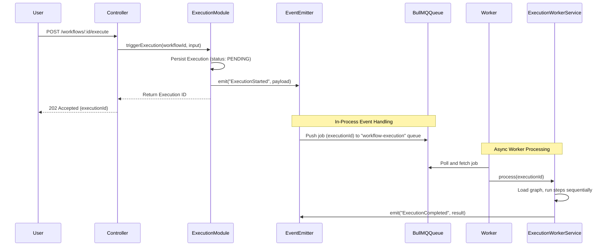

# Qwen Autopilot Platform — Event Design

> **Version**: 2.0.0 (Phase 2 Design)
> **Status**: Approved — awaiting implementation

---

## Domain Event Catalog

The platform utilizes in-process events (NestJS `EventEmitter2`) for immediate cross-module coordination, and queued jobs (BullMQ + Redis) for durable, asynchronous processing.

### Event Definitions

| Event Name           | Source Module        | Payload                                                                | Subscriber Actions                                                      |
| -------------------- | -------------------- | ---------------------------------------------------------------------- | ----------------------------------------------------------------------- |
| `AgentRegistered`    | `AgentModule`        | `{ agentId: string, orgId: string, userId: string }`                   | Create default memory, log audit record.                                |
| `WorkflowCreated`    | `WorkflowModule`     | `{ workflowId: string, orgId: string, definitionHash: string }`        | Register webhooks, log audit record.                                    |
| `ExecutionStarted`   | `ExecutionModule`    | `{ executionId: string, workflowId: string, orgId: string }`           | Transition status to running, push message to BullMQ execution worker.  |
| `StepStarted`        | `ExecutionModule`    | `{ executionId: string, stepId: string, type: string }`                | Initialize step execution database record, emit dashboard updates.      |
| `StepCompleted`      | `ExecutionModule`    | `{ executionId: string, stepId: string, output: Record<string, any> }` | Retrieve next steps in DAG, enqueue next step to workflow queue.        |
| `StepFailed`         | `ExecutionModule`    | `{ executionId: string, stepId: string, error: string }`               | Trigger execution retry rules, transition to FAILED state if exhausted. |
| `MemoryUpdated`      | `MemoryModule`       | `{ agentId: string, executionId: string, keysChanged: string[] }`      | Invalidate cache, index changed values into vector database.            |
| `ExecutionCompleted` | `ExecutionModule`    | `{ executionId: string, durationMs: number }`                          | Log final outputs, send notification alerts, log audit record.          |
| `NotificationSent`   | `NotificationModule` | `{ notificationId: string, channel: string }`                          | Update delivery metrics in analytics.                                   |

---

## Event Flow & Sequence Diagrams

### Asynchronous Execution & Task Processing Flow



---

## Event Envelope Schema

All domain events follow a standardized structure, enabling structured payloads and easy serialization.

```typescript
interface DomainEventEnvelope<TData = any> {
  id: string; // Unique event ID (UUIDv7)
  eventName: string; // Name of the event
  source: string; // Originating module/context
  timestamp: string; // ISO 8601 creation time
  organizationId: string; // Tenancy isolation identifier
  actorId: string | null; // User, Agent or System ID that triggered the event
  requestId: string | null; // Request trace correlation ID
  data: TData; // Schema-validated event payload
}
```

---

## Queue Topology (BullMQ + Redis)

To guarantee durability and operational boundaries, the following queues are configured:

1. **`workflow-execution`**:
   - **Role**: Process step evaluation graphs and navigate branching steps.
   - **Concurrency**: Configured via environment limits.
   - **Retry Policy**: Exponential backoff (delay: 1000ms, factors: 2).

2. **`agent-inference`**:
   - **Role**: Handles specific Qwen/LLM API queries and parsing. This isolates long LLM latencies from graph processing.
   - **Throttling**: Bound to maximum concurrent outbound requests allowed by LLM API providers.

3. **`tool-execution`**:
   - **Role**: Invokes external HTTP endpoints or databases.
   - **Limits**: Configured with strict circuit-breaking policies to avoid bringing down external clients.
