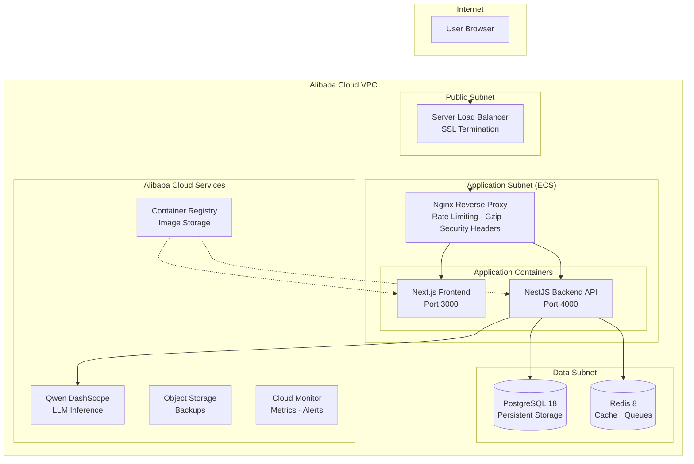
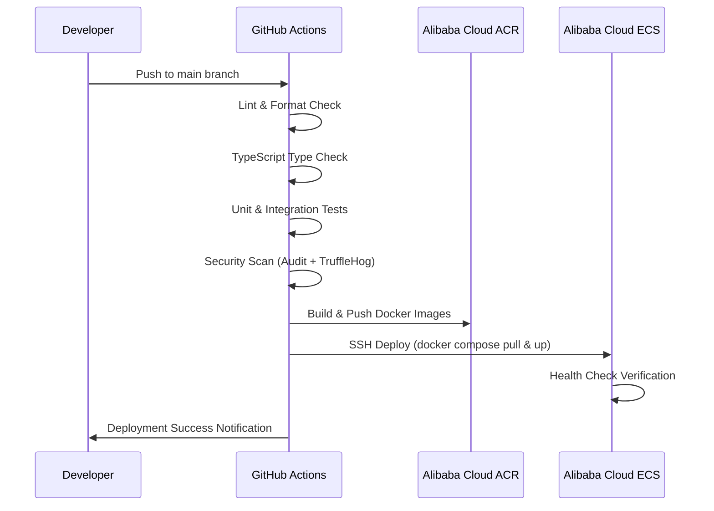

# Production Infrastructure & Deployment Architecture

This document provides the comprehensive infrastructure architecture, deployment topology, operational runbooks, and disaster recovery procedures for the Qwen Autopilot AI platform on Alibaba Cloud.

---

## 1. Infrastructure Topology

---

## 2. Deployment Pipeline

---

## 3. Container Architecture

| Container  | Base Image           | Port    | Resources        |
| ---------- | -------------------- | ------- | ---------------- |
| Nginx      | `nginx:1.27-alpine`  | 80, 443 | -                |
| Backend    | `node:22-alpine`     | 4000    | 2 CPU, 1GB RAM   |
| Frontend   | `node:22-alpine`     | 3000    | 1 CPU, 512MB RAM |
| PostgreSQL | `postgres:18-alpine` | 5432    | 2 CPU, 1GB RAM   |
| Redis      | `redis:8-alpine`     | 6379    | 1 CPU, 512MB RAM |

Monitoring overlay (`docker-compose.monitoring.yml`): Prometheus, Grafana,
Loki, Promtail, node-exporter, cAdvisor, postgres-exporter, redis-exporter —
all on the internal network, Grafana surfaced at `/grafana/` through nginx.

Backend probes: `/api/v1/health/live`, `/ready`, `/startup`; Prometheus
metrics at `/metrics` (internal only). Every container declares CPU/memory
limits, a healthcheck, log rotation (json-file 20 MB × 5), and runs non-root
with tini for graceful shutdown.

---

## 4. Security Architecture

### Network Segmentation

- **Public network**: Only Nginx/SLB exposed on ports 80/443
- **Internal network**: Backend, frontend, Postgres, Redis communicate on isolated bridge network
- **No direct database access** from the internet

### TLS

- Terminated at nginx (`infrastructure/nginx/nginx-tls.conf`): TLS 1.2/1.3
  only, HTTP→HTTPS redirect, HSTS
- Automated issuance/renewal via `infrastructure/scripts/enable-tls.sh`
  (Let's Encrypt ACME webroot) or Alibaba Cloud SSL Certificates

### Security Headers (Nginx)

- `X-Frame-Options: SAMEORIGIN`
- `X-Content-Type-Options: nosniff`
- `Strict-Transport-Security: max-age=31536000` (TLS config)
- `Referrer-Policy: strict-origin-when-cross-origin`
- `Permissions-Policy: camera=(), microphone=(), geolocation=()`

### Rate Limiting

- API endpoints: 30 req/s per IP
- Auth endpoints: 5 req/s per IP

### Container Security

- All containers run as non-root users
- Minimal Alpine base images
- Multi-stage builds (no build tools in production)
- Health checks on every container

---

## 5. Observability

- **Metrics**: prom-client instrumentation across HTTP, AI provider, workflow
  engine, tool executor, and BullMQ queues; scraped by Prometheus, visualized
  in three provisioned Grafana dashboards (Platform Overview, Infrastructure,
  Data Stores) with alert rules for availability, latency, errors, backlog,
  and resource pressure.
- **Logs**: structured pino JSON + nginx JSON access logs shipped to Loki via
  Promtail; correlated end-to-end by `x-request-id`.
- **Traces**: OpenTelemetry auto-instrumentation (HTTP/Fastify/PostgreSQL/
  Redis), OTLP export, opt-in via `OTEL_ENABLED=true`.

Full reference: [docs/operations/monitoring-guide.md](../operations/monitoring-guide.md)

---

## 6. Operations Documentation

| Guide                                                                   | Contents                                                  |
| ----------------------------------------------------------------------- | --------------------------------------------------------- |
| [Runbook](../operations/runbook.md)                                     | Day-2 ops, deploys, incident playbooks, log correlation   |
| [Disaster Recovery](../operations/disaster-recovery.md)                 | RTO/RPO, backup inventory, scenario procedures, DR drills |
| [Monitoring Guide](../operations/monitoring-guide.md)                   | Dashboards, metric reference, alerts, Loki queries        |
| [Scaling Guide](../operations/scaling-guide.md)                         | Vertical → horizontal → workers → managed data stores     |
| [CI/CD](../operations/ci-cd.md)                                         | Pipeline stages, release/rollback workflows, secrets      |
| [Alibaba Cloud Integration](../operations/alibaba-cloud-integration.md) | Per-service setup and least-privilege RAM design          |
| [Hackathon Evidence](../operations/hackathon-evidence.md)               | How judges verify the Alibaba Cloud deployment            |
| [Load Testing](../../tests/load/README.md)                              | k6 smoke/load/stress suites and SLO thresholds            |

---

## 7. Alibaba Cloud Integration Evidence

The platform uses the following Alibaba Cloud services:

1. **Qwen DashScope**: All LLM inference calls route through `dashscope-intl.aliyuncs.com`
2. **ECS**: Production hosting on `ecs.g7.xlarge` instances (ap-southeast-1)
3. **ACR**: Docker images at `registry.ap-southeast-1.aliyuncs.com/qwen-autopilot`
4. **OSS**: Off-host nightly database backups
5. **Cloud Monitor**: Infrastructure metrics and alerting
6. **KMS**: Secret escrow for disaster recovery

See [services-manifest.yml](../../infrastructure/alibaba-cloud/services-manifest.yml) for complete integration details and [hackathon-evidence.md](../operations/hackathon-evidence.md) for the verification walkthrough.
