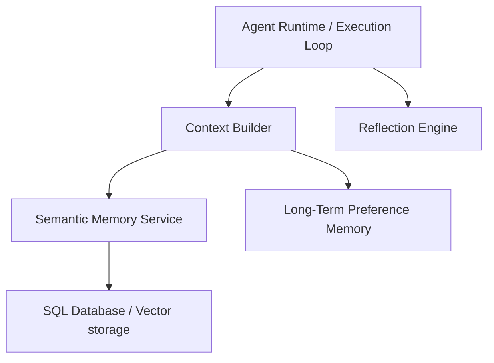
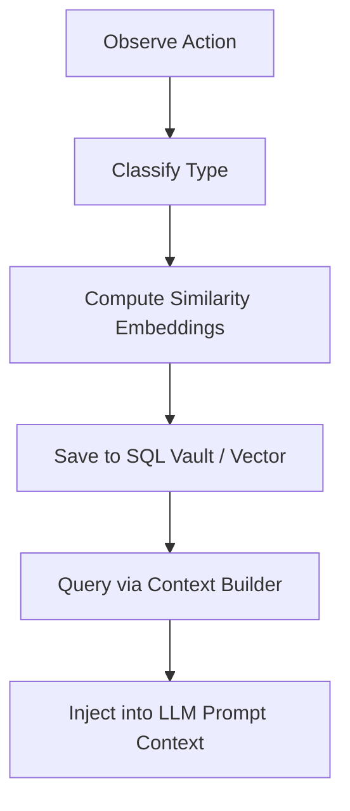
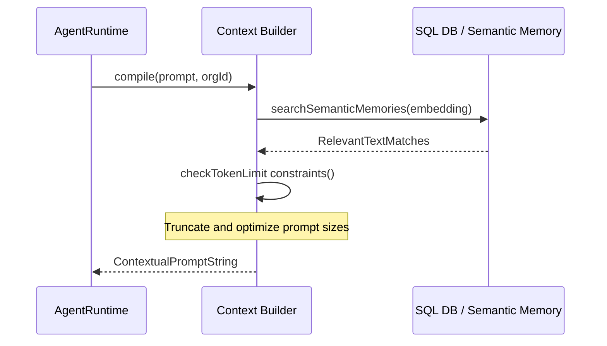
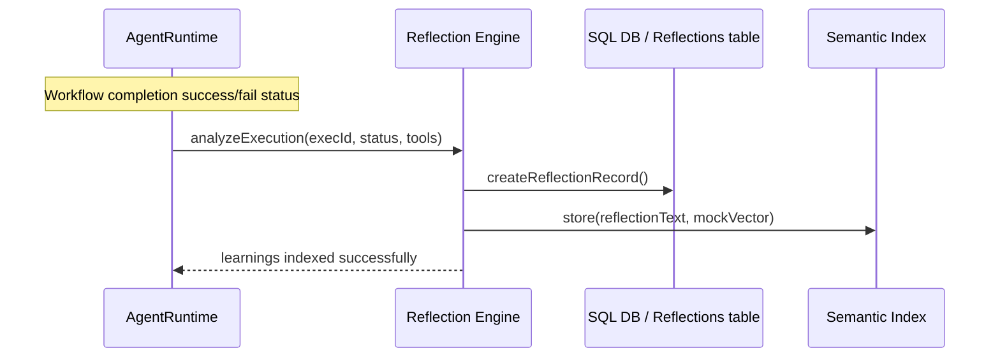

# Memory & Context Subsystem Architecture & Developer Guide

This document describes the component configurations, lifecycles, and operational runbooks for the Memory and Context subsystem.

---

## 1. System Components & Topology

The memory subsystem is decoupled from workflows. It provides short-term memory (during executions), long-term memory (user preferences), semantic index stores, and reflection generators.

---

## 2. Dynamic Lifecycle Pipelines

### Complete Memory Lifecycle

### Context Builder Pipeline

### Reflection Pipeline

---

## 3. Security & Multi-Tenancy

1. **Organization Isolation**: Every memory lookup enforces filters against the active session `orgId`.
2. **Metadata filtering**: Restricts access context parameters.
3. **Data Protection**: Encrypts sensitive entities if designated.

---

## 4. Operational Runbooks

### Cleaning Stale Memories

1. **Diagnosis**: If context building yields irrelevant historical prompt instructions.
2. **Remediation**:
   - Navigate to **Vault Settings > Memory Explorer**.
   - Clear or soft-delete specific keys from preferences.
   - Adjust default token bounds to compress history further.
