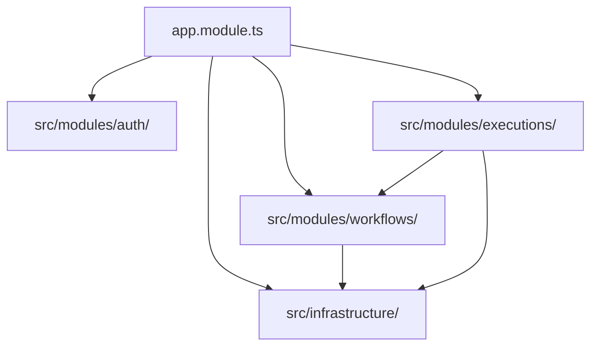

# Qwen Autopilot Platform — Module Structure

> **Version**: 2.0.0 (Phase 2 Design)
> **Status**: Approved — awaiting implementation

---

## Backend Folder Structure (NestJS Monolith)

The NestJS backend application enforces separation of concerns by containing all logic within domain-focused modules under `apps/backend/src/modules/`.

```text
apps/backend/
├── src/
│   ├── config/                      # Environment schema validation
│   ├── common/                      # Shared exception filters, guards, decorators
│   │   ├── decorators/              # Tenant, user context extractors
│   │   ├── filters/                 # Global error envelopes
│   │   ├── guards/                  # JWT auth, tenant match verification
│   │   └── interceptors/            # JSON response parsing
│   ├── infrastructure/              # Database connection clients
│   │   ├── database/                # Prisma service definitions
│   │   └── redis/                   # Redis, BullMQ client connections
│   ├── modules/                     # Domain bounded contexts
│   │   ├── auth/                    # Login, register, token refreshes
│   │   ├── users/                   # User profile management
│   │   ├── organizations/           # Multi-tenant limits, members
│   │   ├── agents/                  # Prompting, model configuration, version records
│   │   ├── tools/                   # Extensible integrations, parameters schemas
│   │   ├── memory/                  # Key-value memories, semantic embeddings
│   │   ├── workflows/               # Directed graph definitions, pipelines
│   │   └── executions/              # State execution, step histories, BullMQ processing
│   ├── app.module.ts                # Application root definition
│   └── main.ts                      # Fastify bootstrap script
```

---

## Frontend Folder Structure (Next.js App Router)

The Next.js frontend implements Next.js App Router layout patterns with TailwindCSS styling.

```text
apps/frontend/
├── src/
│   ├── app/                         # App Router layout tree
│   │   ├── layout.tsx               # Providers & styling
│   │   ├── (auth)/                  # Login, register views
│   │   ├── (dashboard)/             # Standard dashboard shell
│   │   │   ├── agents/              # Agent builder & registry UI
│   │   │   ├── workflows/           # Flow builder visual UI
│   │   │   └── executions/          # Execution metrics & step trace logs
│   │   └── page.tsx                 # Root dashboard landing
│   ├── components/                  # UI modular widgets
│   │   ├── shared/                  # Common navs, tables, states
│   │   ├── agents/                  # Builder input widgets
│   │   └── workflows/               # visual graph elements (shadcn/React Flow)
│   ├── hooks/                       # Custom TanStack query hooks
│   ├── lib/                         # Axios client, Query configuration
│   └── state/                       # Zustand store managers
```

---

## Dependency Flow & Circular Prevention Rules

To guarantee compilation speed and architecture sanity, the following rules are enforced:

### Module Import Limits

- Outer layers (`modules/`) may import generic utilities (`common/`, `config/`) and `infrastructure/` wrappers.
- Inner layers never import module details of other domains directly. Example: the `workflows` module cannot import `executions` files. If communication is needed, it must happen via domain services, shared packages (`packages/shared-types`), or domain events.



### Static Analysis

A script in `scripts/lint.sh` utilizes validation check rules (ESLint import rules or custom dependency validations) to block circular imports and flag modules trying to reach into other module namespaces.
