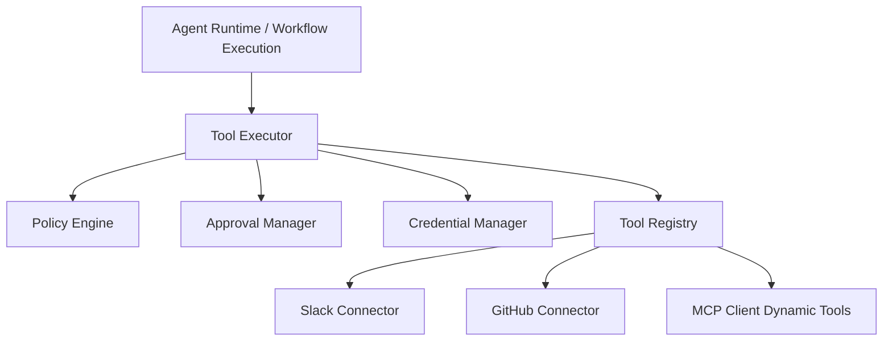
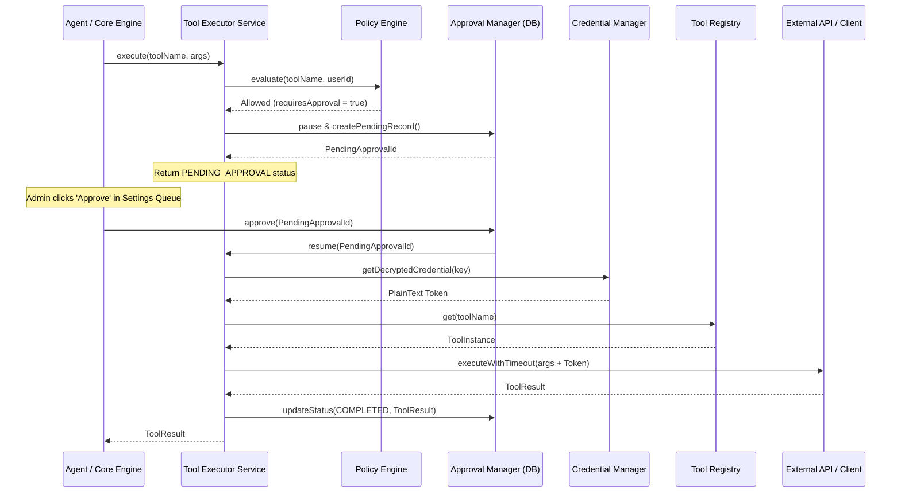

# Tool Execution Framework Architecture & Developer Guide

This document describes the component topology, execution sequences, connector designs, MCP integration patterns, security profiles, and runbooks of the Tool Execution Framework.

---

## 1. System Components & Topology

The Tool Execution Framework enables agents to safely interface with external environments. It enforces security policies, handles manual approval gates, decrypts credentials, and audits actions.



---

## 2. Dynamic Lifecycle Pipelines

### Complete Execution Pipeline



---

## 3. Connector Framework Architecture

Connectors are structured extensions subclassed from a unified [Connector](file:///home/talented/Desktop/Personal/qwen_hack/apps/backend/src/modules/tools/connector-framework.ts) base:

```typescript
export abstract class Connector extends Tool {
  abstract override readonly metadata: ConnectorMetadata;
}
```

Every connector defines custom inputs and output schemas verified by Zod validators. They must not include business execution state, rendering them modular, isolated, and stateless.

---

## 4. MCP Dynamic Integration Guide

The Model Context Protocol (MCP) discovers and integrates tools dynamically at runtime:

1. **Dynamic Tool Specs**: Standardizes JSON-Schema descriptions.
2. **Standard Inputs/Outputs**: Allows standardizing parameters without code updates.
3. **Transport Protocol**: Connects via Stdio processes or HTTP/SSE servers, managed inside [McpClientService](file:///home/talented/Desktop/Personal/qwen_hack/apps/backend/src/modules/tools/mcp-client.service.ts).

---

## 5. Security Model & Credentials Vault

1. **AES-256-GCM Storage**: Sensitive parameters (tokens, keys) are encrypted before writing to SQL databases.
2. **Derivation Keys**: Strong unique keys are derived from the system secret via SHA-256 hashing.
3. **Policy Control**: Fine-grained RBAC and policy checks guard execution targets against unauthorized users.

---

## 6. Operational Runbooks

### Approving Stuck Executions

1. **Diagnosis**: If an agent hangs or returns `PENDING_APPROVAL` status.
2. **Remediation**:
   - Navigate to **Vault Settings > Approvals Queue**.
   - Review arguments payload risk level.
   - Click **Approve** to resume execution.
