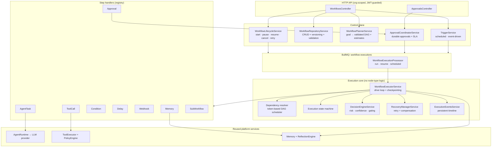
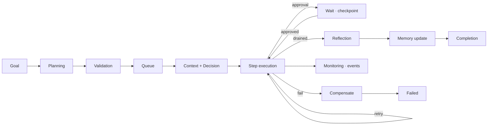
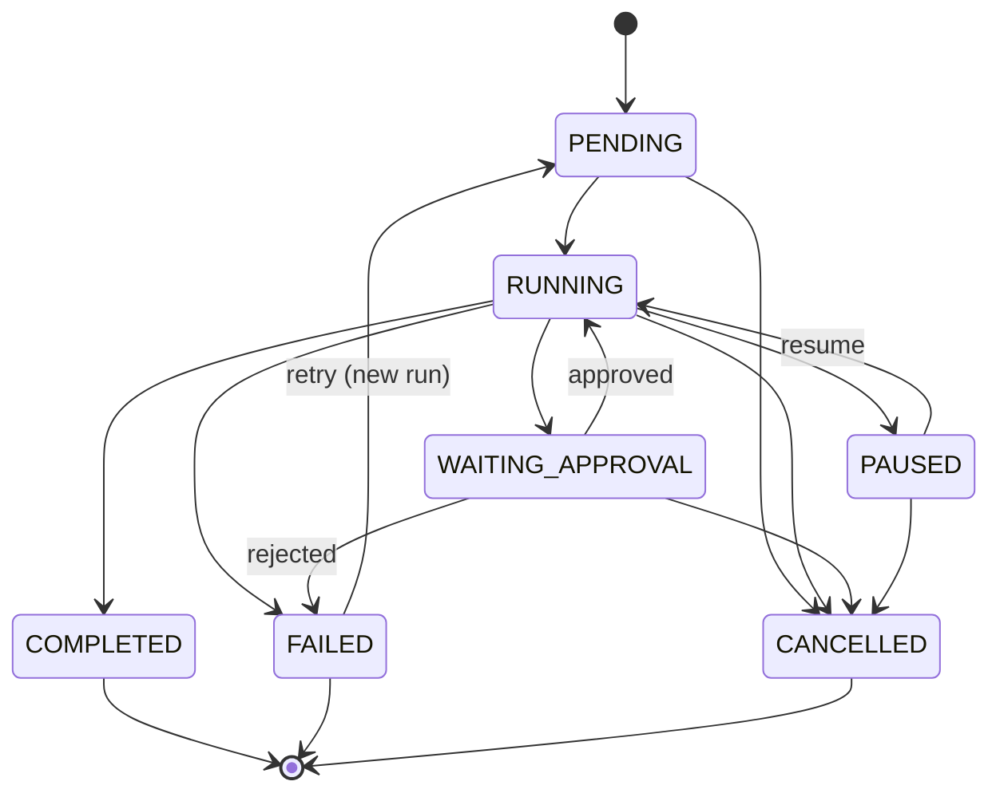
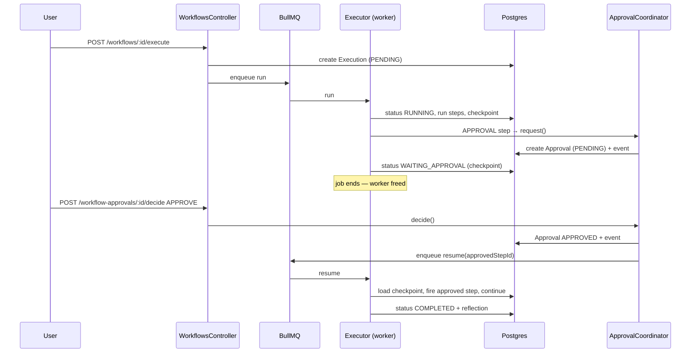
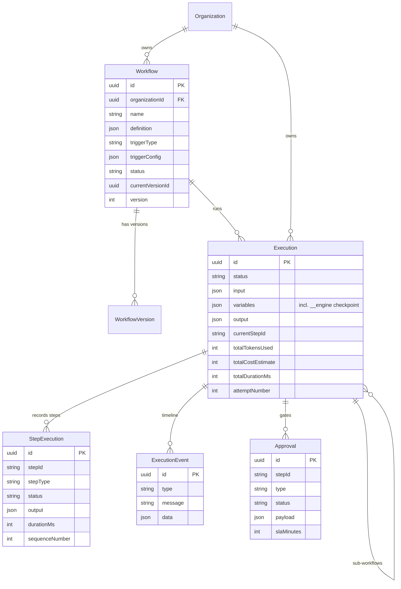

# Autonomous Business Workflow Engine

The workflow engine is the platform's core capability: it turns declarative
workflow definitions (or natural-language goals) into resilient, observable,
multi-tenant autonomous executions. It orchestrates agent reasoning, tool
calls, human approvals, and failure recovery without any workflow-specific
logic in the core — every node type is a pluggable handler.

## Design principles

| Principle                 | How it is realized                                                                                             |
| ------------------------- | -------------------------------------------------------------------------------------------------------------- |
| **Declarative**           | Workflows are JSON (`steps` + `connections`); the engine interprets them. Authoring needs no code.             |
| **Modular / extensible**  | Node types are handlers behind a registry (`STEP_HANDLERS` multi-provider). Adding a type = one class.         |
| **Event-driven**          | Execution runs on a BullMQ queue; every transition emits a persisted timeline event.                           |
| **Resilient**             | Per-step retry with backoff, saga-style compensation, checkpoint-and-resume across restarts.                   |
| **Observable**            | Full step + event history in Postgres; token/cost/duration accounting; Prometheus metrics from earlier phases. |
| **Secure & multi-tenant** | Every route and query is org-scoped via the JWT principal; JWT auth guards all endpoints.                      |
| **Provider-independent**  | AI turns go through the shared `AgentRuntime` → LLM provider abstraction, not Qwen directly.                   |

## Component map

## Execution lifecycle

## Execution state machine

Persisted on `Execution.status`; every transition is guarded by
`assertTransition()`.

## DAG scheduling (dependency resolver)

The resolver uses **token/firing semantics** so one algorithm handles
sequential, parallel, conditional, and bounded-loop flows:

- Completing a step fires a **real** token along its selected outgoing edges
  (all edges for normal steps; the label-matched edge for `CONDITION`).
- Unselected branches fire **skip** tokens so join steps never wait forever.
- A step is **ready** when every incoming non-loop edge delivered a token and
  at least one was real; **skipped** if all were skips (skips propagate).
- Edges labelled `loop` re-arm their target, bounded by `loop.maxIterations`.

The whole scheduler state is JSON-serializable and checkpointed after every
wave, which is what makes pause/resume and restart-recovery possible.

## Sequence — approval pause & resume

## Failure recovery

1. **Retry** — each step honors its `retry` policy (attempts, backoff). Retries
   emit `STEP_RETRIED` timeline events.
2. **Graceful degradation** — a step with `onFailure: "continue"` records its
   error into the variable bag and the run proceeds.
3. **Compensation** — steps declare a `compensation` tool call. On terminal
   failure the recovery manager unwinds registered compensations in reverse
   order (saga pattern), best-effort.
4. **Checkpoint recovery** — the full scheduler state is persisted after every
   wave, so a crashed worker resumes exactly where it left off.
5. **Manual intervention** — pause/resume/cancel/retry are first-class controls.

## Data model (ER)

## Key files

| File                                             | Responsibility                                                         |
| ------------------------------------------------ | ---------------------------------------------------------------------- |
| `engine/workflow-definition.schema.ts`           | Declarative schema (node types, retry, compensation, loops, estimates) |
| `engine/dependency-resolver.ts`                  | Token-based DAG scheduler + structural validation                      |
| `engine/execution-state.ts`                      | State machine + event/step status enums                                |
| `engine/workflow-executor.service.ts`            | The orchestrator core (drive loop, checkpointing, recovery wiring)     |
| `engine/step-handler.registry.ts` + `handlers/*` | Pluggable node types                                                   |
| `engine/decision-engine.service.ts`              | Runtime risk/confidence gating                                         |
| `engine/recovery-manager.service.ts`             | Retry + compensation                                                   |
| `engine/approval-coordinator.service.ts`         | Durable approvals + SLA escalation                                     |
| `engine/workflow-lifecycle.service.ts`           | start/pause/resume/cancel/retry                                        |
| `engine/workflow-planner.service.ts`             | Goal → validated DAG + estimates                                       |
| `engine/workflow-repository.service.ts`          | CRUD + versioning + validation                                         |
| `engine/trigger.service.ts`                      | Scheduled (cron) + event-driven triggers                               |
| `engine/workflow-execution.processor.ts`         | BullMQ worker                                                          |
| `engine/reference-templates.ts`                  | 6 production reference workflows                                       |

See also: [workflow-template-guide.md](../workflows/workflow-template-guide.md),
[workflow-extension-guide.md](../workflows/workflow-extension-guide.md),
[workflow-runbook.md](../operations/workflow-runbook.md).
