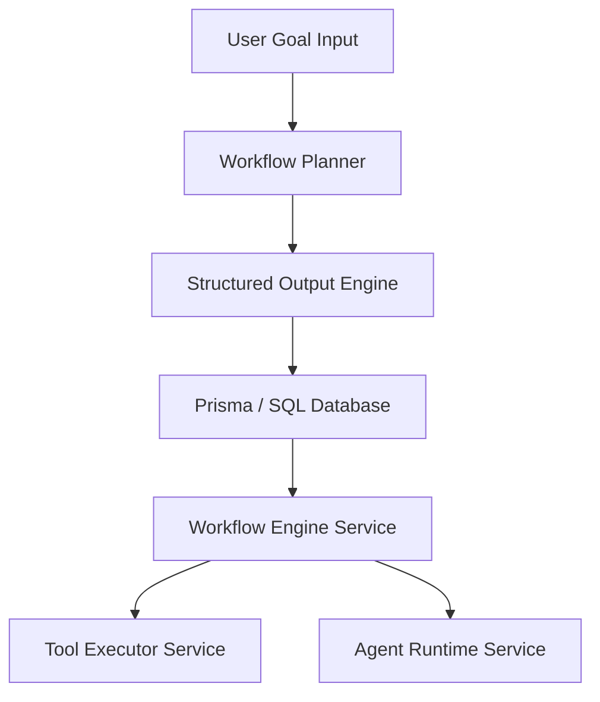
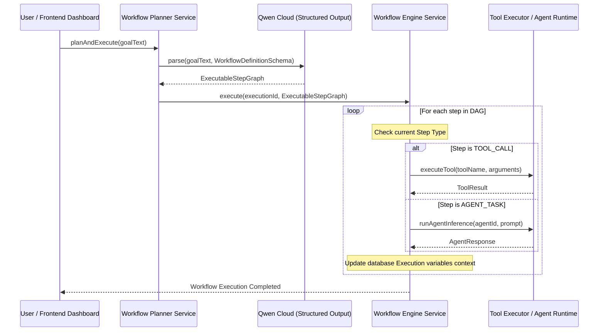
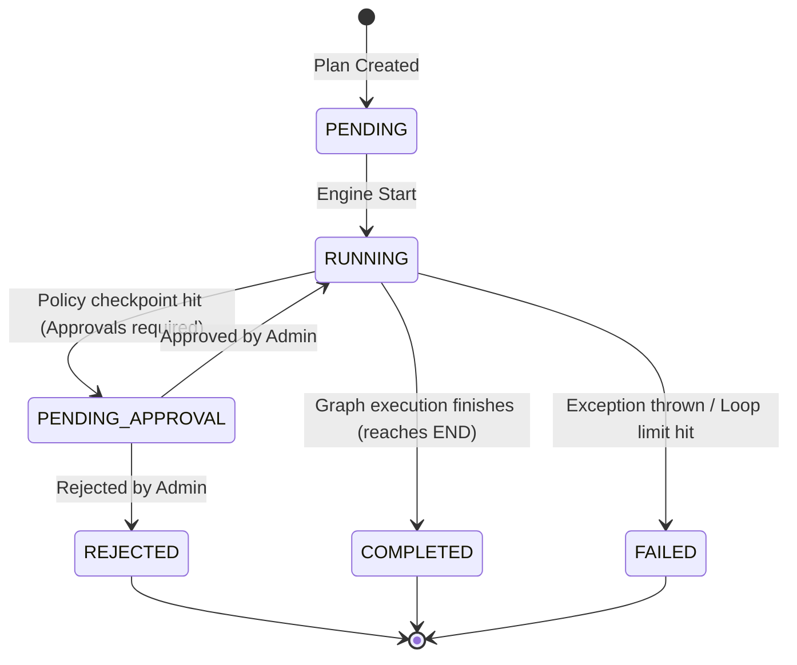

# Autonomous Business Workflow Engine Architecture & Developer Guide

This document describes the component configurations, dynamic AI planners, state machines, templates library, and operational guides for the Autonomous Business Workflow Engine.

---

## 1. System Components & Topology

The workflow engine interprets goals, builds execution graphs (DAGs), resolves step dependencies, monitors state runs, and recovers from anomalies.

---

## 2. Dynamic Lifecycle Pipelines

### Complete AI-Driven Workflow Lifecycle

### State Machine Lifecycle Transitions

---

## 3. Pre-configured Enterprise Templates

Seeded templates are defined inside [workflow-templates.ts](file:///home/talented/Desktop/Personal/qwen_hack/apps/backend/src/modules/workflows/workflow-templates.ts):

1. **Support Diagnostics & Escalation**:
   -Urgency Classification -> SQLite health check query -> Slack alerts escalation if urgent.
2. **Customer Inquiry Proposal**:
   -Enriches details -> drafts email proposal templates automatically using Assistant models.

---

## 4. Operational Runbooks

### Recovering from Failed Execution Loops

1. **Diagnosis**: If an execution hangs with status `RUNNING` or gets cancelled. Loop guards limit iterations to exactly 30 cycles.
2. **Remediation**:
   - Check **Workflow Designer > Execution Monitor**.
   - Review variables parameters schema for loop cycles.
   - Re-draft goal to optimize split conditions logic.
