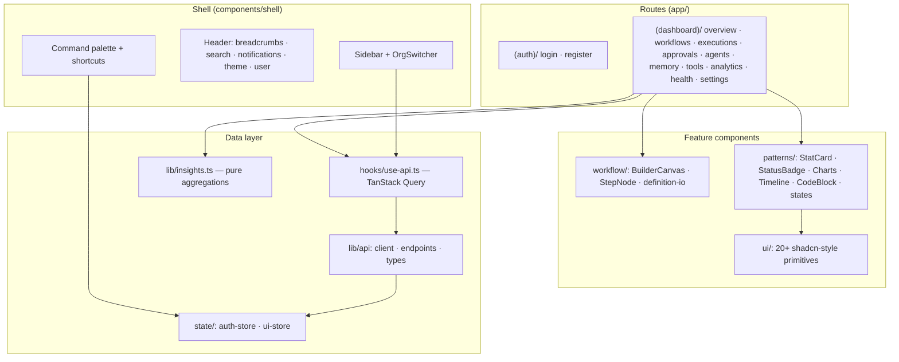

# Frontend Architecture

The frontend is an **AI Operations Console** — a Next.js App Router application for
creating, running, observing, and governing autonomous business agents.

## Stack

| Concern         | Choice                                | Rationale                                                                               |
| --------------- | ------------------------------------- | --------------------------------------------------------------------------------------- |
| Framework       | Next.js (App Router) + TypeScript     | RSC-ready routing, typed routes (`typedRoutes: true`), standalone output for containers |
| Styling         | Tailwind CSS 4 + design tokens        | Token-driven theming (light/dark) with zero runtime cost                                |
| Components      | shadcn/ui-style primitives on Radix   | Accessible headless behavior, fully ownable code (no lib lock-in)                       |
| Server state    | TanStack Query                        | Caching, polling, optimistic updates, error/loading states                              |
| Client state    | Zustand (persisted where appropriate) | Minimal global state: auth session + UI preferences only                                |
| Forms           | React Hook Form + Zod                 | Schema-validated forms matching backend DTOs                                            |
| Charts          | Recharts (wrapped)                    | Themed wrappers keep every chart on the token palette                                   |
| Workflow canvas | React Flow (`@xyflow/react`)          | Node/edge editing, custom nodes, minimap, controls                                      |
| Code editing    | Monaco (lazy-loaded)                  | JSON definition editing in the builder only                                             |
| Command palette | cmdk                                  | ⌘K navigation + actions                                                                 |
| Notifications   | Sonner                                | Toasts; in-app notification center is custom                                            |

## Layer diagram

## Data flow

1. **`lib/api/endpoints.ts`** is the only place HTTP happens — typed functions per
   backend controller, unwrapping the `{ success, data }` envelope.
2. **`hooks/use-api.ts`** wraps every endpoint in a TanStack Query hook with a
   central `queryKeys` map. Mutations invalidate exactly the keys they affect and
   surface errors through Sonner toasts. The approvals mutation applies an
   **optimistic update** (removes the item from the queue before the server
   confirms).
3. **Live data**: executions and approvals poll (4s while anything is running,
   30s idle, per-query `refetchInterval` functions). The transport is isolated in
   the hooks so SSE/WebSocket can replace polling without touching any page.
4. **Client-side analytics** (`lib/insights.ts`) are pure functions over the
   execution/tool-history collections — unit-tested and shared by Overview and
   Analytics so the numbers always agree.

## Authentication

- `state/auth-store.ts` (Zustand + `persist`) holds `{ accessToken, user }` in
  localStorage; `hasHydrated` gates rendering so refreshes don't flash to login.
- `lib/api/client.ts` reads the token per-request via `bindAuth()` (no global
  axios mutation) and clears the session on any 401.
- `AppShell` redirects unauthenticated visitors; org switching swaps the JWT via
  `/organizations/switch` and invalidates the entire query cache (all data is
  org-scoped).

## Performance decisions

- **React Flow and Monaco are dynamically imported** (`next/dynamic`,
  `ssr: false`) — they only load on the builder/execution-graph routes; Monaco
  only when the JSON dialog opens.
- Chart pages render inside `ChartCard` with explicit heights to avoid layout shift.
- `next.config.ts` uses `output: "standalone"` for minimal container images.
- Route-level code splitting is automatic per Next.js; the shell chunk stays lean
  because heavy feature components live behind route boundaries.

## Real-time readiness

Current transport is polling (see above). The upgrade path to SSE/WebSockets is:
implement a `subscribe(queryKey)` helper that pushes into the Query cache via
`queryClient.setQueryData` — consumers (pages/notifications) are already
transport-agnostic because they only read query state.
