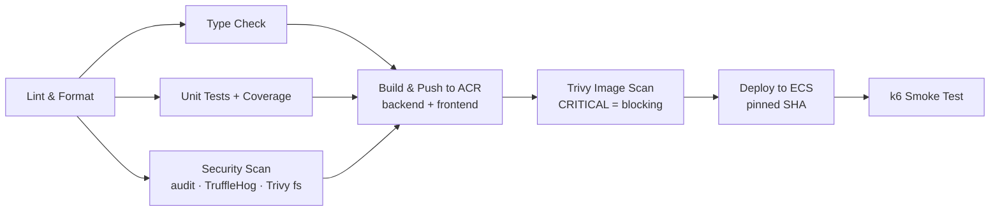

# CI/CD Pipeline

GitHub Actions is the CI platform. Three workflows in `.github/workflows/`:

## 1. `ci-cd.yml` — main pipeline



- **PRs / develop**: quality gates only (lint → typecheck → test → security).
- **main**: full path through deployment. Images are tagged with the **git
  SHA** and `latest`; the deploy pins `IMAGE_TAG=<sha>` in the server's `.env`
  so what runs is always attributable to a commit and instantly revertible.
- **Blocking image scan**: unpatched CRITICAL CVEs in the built images stop
  the deploy (`ignore-unfixed: true` avoids blocking on CVEs with no fix).
- **Deployment verification**: nginx health + backend readiness endpoints must
  return 200, then a k6 smoke test (30s, SLO thresholds) runs against the live
  deployment. A failed smoke test fails the workflow — the run is visibly red.

## 2. `release.yml` — versioned releases

Push a tag → versioned artifacts + release notes:

```bash
git tag v1.0.0 && git push origin v1.0.0
```

Produces: `backend:v1.0.0` / `frontend:v1.0.0` in ACR, a CycloneDX SBOM
attached to the release, and auto-generated release notes from merged PRs.

## 3. `rollback.yml` — one-click rollback / redeploy

Actions → **Rollback / Redeploy** → enter any previously built tag (CI SHA or
release version). Pins the tag on the server, pulls, restarts, verifies
health. Because every deploy is image-pinned, rollback is a pure pointer move
— no rebuild, ~2 minutes.

## Required GitHub Secrets

| Secret         | Purpose                                       |
| -------------- | --------------------------------------------- |
| `ACR_USERNAME` | Alibaba Cloud Container Registry login        |
| `ACR_PASSWORD` | ACR password (use a Registry-scoped RAM user) |
| `ECS_HOST`     | Production instance public IP                 |
| `ECS_USERNAME` | SSH user (e.g. `root` or a deploy user)       |
| `ECS_SSH_KEY`  | Private key matching the ECS key pair         |

Configure a **production environment** in repo settings with required
reviewers if you want manual approval before the deploy job runs.

## Design decisions

- **SSH-based deploy over cloud-init/ROS**: single-instance compose target;
  SSH + `docker compose pull && up -d` is transparent, debuggable, and leaves
  an audit trail in Actions logs. Revisit if instance count grows (then: ACK
  or multiple ECS behind SLB with a deploy fan-out).
- **GitHub Actions over Alibaba Cloud DevOps**: hackathon judging requires a
  public, verifiable pipeline; Actions logs double as deployment evidence.
- **Trivy at two layers**: fs scan early (fast feedback, non-blocking) and
  image scan late (blocking) — catches both dependency CVEs and base-image
  CVEs without slowing PR iteration.
