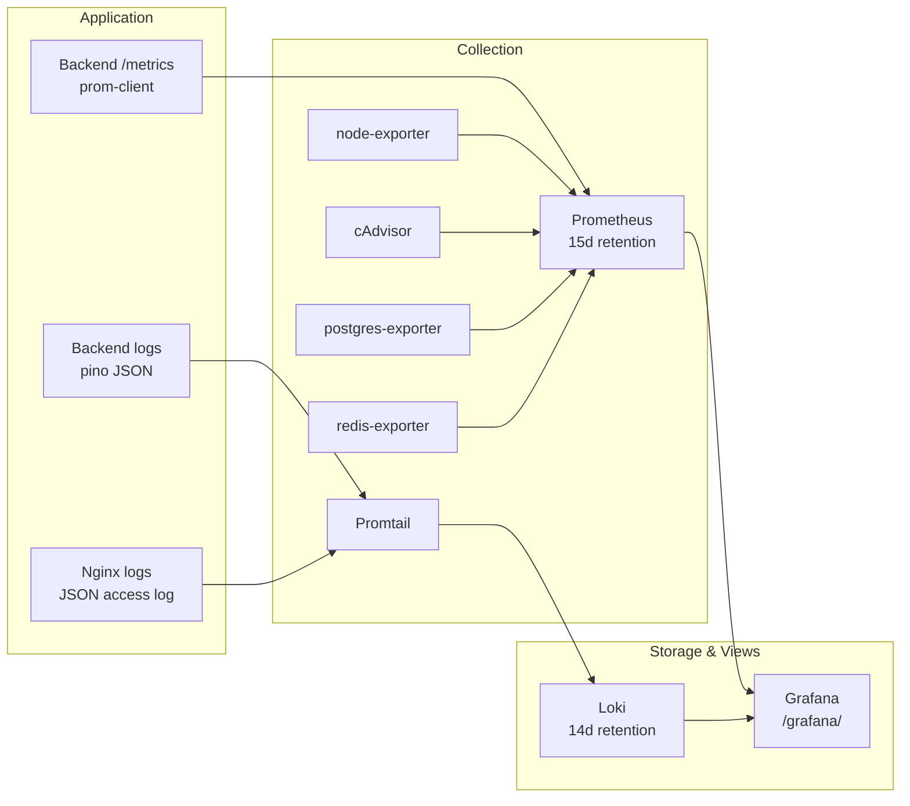

# Monitoring & Observability Guide

## Stack

Deploy: `make monitoring-up`. Access: `https://<domain>/grafana/`
(credentials: `GRAFANA_ADMIN_USER` / `GRAFANA_ADMIN_PASSWORD` from `.env`).

Optional distributed tracing: set `OTEL_ENABLED=true` and point
`OTEL_EXPORTER_OTLP_ENDPOINT` at an OTLP/HTTP collector (e.g. a Jaeger or
Alibaba Cloud Managed Service for OpenTelemetry endpoint). Auto-instruments
HTTP, Fastify, PostgreSQL, and Redis spans.

## Dashboards (provisioned automatically)

| Dashboard             | Answers                                                                                                                                   |
| --------------------- | ----------------------------------------------------------------------------------------------------------------------------------------- |
| **Platform Overview** | Request rate/latency/errors per route, AI usage per model & organization, workflow success, queue depth, tool executions, live error logs |
| **Infrastructure**    | Host CPU/memory/disk/network, per-container CPU & memory, all container logs                                                              |
| **Data Stores**       | PostgreSQL connections/transactions/cache-hit ratio, Redis memory/ops/clients                                                             |

## Application Metric Reference

Exposed at `GET /metrics` (internal network only, Prometheus text format):

| Metric                                | Type      | Labels                                              |
| ------------------------------------- | --------- | --------------------------------------------------- |
| `http_requests_total`                 | counter   | method, route, status_code                          |
| `http_request_duration_seconds`       | histogram | method, route, status_code                          |
| `ai_requests_total`                   | counter   | model, status                                       |
| `ai_request_duration_seconds`         | histogram | model                                               |
| `ai_tokens_total`                     | counter   | model, organization                                 |
| `workflow_executions_total`           | counter   | status                                              |
| `workflow_execution_duration_seconds` | histogram | status                                              |
| `workflow_steps_total`                | counter   | type, status                                        |
| `tool_executions_total`               | counter   | tool, status                                        |
| `tool_execution_duration_seconds`     | histogram | tool                                                |
| `bullmq_queue_jobs`                   | gauge     | queue, state (discovered from Redis at scrape time) |
| `process_*`, `nodejs_*`               | default   | event-loop lag, heap, GC, CPU                       |

`ai_tokens_total{organization=...}` powers per-organization usage and cost
dashboards: multiply by the model's per-token price in a Grafana panel to get
spend (`sum by (organization) (increase(ai_tokens_total[30d])) * <price>`).

## Alerts

Defined in `infrastructure/monitoring/prometheus/alerts.yml`:

| Alert                           | Condition                | Severity |
| ------------------------------- | ------------------------ | -------- |
| BackendDown                     | scrape failing 1m        | critical |
| PostgresDown / RedisDown        | exporter reports down 1m | critical |
| HighErrorRate                   | 5xx > 5% for 5m          | critical |
| HighApiLatency                  | p95 > 2s for 10m         | warning  |
| WorkflowFailureSpike            | >25% failures for 15m    | warning  |
| QueueBacklog                    | >1000 waiting for 10m    | warning  |
| AiProviderErrors                | >20% AI errors for 10m   | warning  |
| HostHighMemory / DiskAlmostFull | >90% / >85%              | warning  |
| PostgresConnectionsSaturated    | >80% of max_connections  | warning  |

To page on-call, add Alertmanager to `docker-compose.monitoring.yml` and route
to DingTalk/Slack/email. Alerts are currently visible in Prometheus → Alerts
and Grafana.

## Logs

- All containers ship to Loki via Promtail (Docker service discovery), labelled
  `container` and `service`.
- Backend pino JSON logs get a `level` label; query errors with
  `{service="backend"} | json | level >= 50`.
- Nginx access logs are JSON with `request_id` — the same ID the backend logs
  and returns in the `x-request-id` response header. One ID traces a request
  through every layer.
- Container stdout is also capped on-disk by the json-file driver
  (20 MB × 5 files per container) so logs can never fill the disk.

## Alibaba Cloud Monitor

The ECS console provides instance-level CPU/memory/disk/network graphs and
alarms out of the box (CloudMonitor agent ships with Alibaba ECS images). Use
it as the outer watchdog — it keeps working even if the on-host monitoring
stack itself is down. Recommended CloudMonitor alarm: instance CPU > 90% for
5m, and an HTTP site monitor against `https://<domain>/health`.
